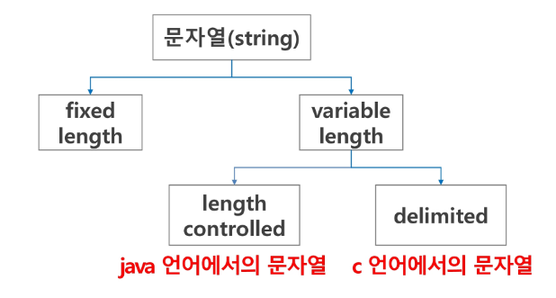

# APS(Algorithm Problem Solving) 기본

## 문자열

### 문자의 표현

- 컴퓨터에서의 문자 표현
  - 영어가 대소문자 합쳐서 52자이므로 6(64가지)비트면 모두 표현할 수 있다. 이를 코드체계라고 한다.
    - 000000 -> 'a', 000001 -> 'b'
- 네트워크가 발전되기 전 미국의 각 지역별로 코드 체계를 정해 놓고 사용했지만 네트워크가 발전하면서 서로간에 정보를 주고 받을 때 정보를 달리 해석한다는 문제가 생겼다.
- 이런한 혼동을 피가기 위해 1967년, 미국에서 ASCII(American Standard Code for Infomation Interchange)라는 문자 인코딩 표준이 제정되었다.

#### ASCII

- ASCII는 7-bit 인코딩으로 128문자를 표현하며, 33개의 출력 불가능한 제어 문자들과 공백을 비롯한 95개의 출력 가능한 문자들로 이루어져 있다.

  | 10진수 | 16진수 | 문자 | 10진수 | 16진수 |    문자    | 10진수 | 16진수 | 문자 | 10진수 | 16진수 | 문자 |
  | :----: | :----: | :--: | :----: | :----: | :--------: | :----: | :----: | :--: | :----: | :----: | :--: |
  |   0    |  0x00  | NUL  |   32   |  0x20  |   Space    |   64   |  0x40  |  @   |   96   |  0x60  |  `   |
  |   1    |  0x01  | SOH  |   33   |  0x21  |     !      |   65   |  0x41  |  A   |   97   |  0x61  |  a   |
  |   2    |  0x02  | STX  |   34   |  0x22  |     "      |   66   |  0x42  |  B   |   98   |  0x62  |  b   |
  |   3    |  0x03  | ETX  |   35   |  0x23  |     #      |   67   |  0x43  |  C   |   99   |  0x63  |  c   |
  |   4    |  0x04  | EOT  |   36   |  0x24  |     $      |   68   |  0x44  |  D   |  100   |  0x64  |  d   |
  |   5    |  0x05  | ENQ  |   37   |  0x25  |     %      |   69   |  0x45  |  E   |  101   |  0x65  |  e   |
  |   6    |  0x06  | ACK  |   38   |  0x26  |   &amp;    |   70   |  0x46  |  F   |  102   |  0x66  |  f   |
  |   7    |  0x07  | BEL  |   39   |  0x27  |     '      |   71   |  0x47  |  G   |  103   |  0x67  |  g   |
  |   8    |  0x08  |  BS  |   40   |  0x28  |     (      |   72   |  0x48  |  H   |  104   |  0x68  |  h   |
  |   9    |  0x09  | TAB  |   41   |  0x29  |     )      |   73   |  0x49  |  I   |  105   |  0x69  |  i   |
  |   10   |  0x0A  |  LF  |   42   |  0x2A  |     \*     |   74   |  0x4A  |  J   |  106   |  0x6A  |  j   |
  |   11   |  0x0B  |  VT  |   43   |  0x2B  |     +      |   75   |  0x4B  |  K   |  107   |  0x6B  |  k   |
  |   12   |  0x0C  |  FF  |   44   |  0x2C  |     ,      |   76   |  0x4C  |  L   |  108   |  0x6C  |  l   |
  |   13   |  0x0D  |  CR  |   45   |  0x2D  |     -      |   77   |  0x4D  |  M   |  109   |  0x6D  |  m   |
  |   14   |  0x0E  |  SO  |   46   |  0x2E  |     .      |   78   |  0x4E  |  N   |  110   |  0x6E  |  n   |
  |   15   |  0x0F  |  SI  |   47   |  0x2F  |     /      |   79   |  0x4F  |  O   |  111   |  0x6F  |  o   |
  |   16   |  0x10  | DLE  |   48   |  0x30  |     0      |   80   |  0x50  |  P   |  112   |  0x70  |  p   |
  |   17   |  0x11  | DC1  |   49   |  0x31  |     1      |   81   |  0x51  |  Q   |  113   |  0x71  |  q   |
  |   18   |  0x12  | DC2  |   50   |  0x32  |     2      |   82   |  0x52  |  R   |  114   |  0x72  |  r   |
  |   19   |  0x13  | DC3  |   51   |  0x33  |     3      |   83   |  0x53  |  S   |  115   |  0x73  |  s   |
  |   20   |  0x14  | DC4  |   52   |  0x34  |     4      |   84   |  0x54  |  T   |  116   |  0x74  |  t   |
  |   21   |  0x15  | NAK  |   53   |  0x35  |     5      |   85   |  0x55  |  U   |  117   |  0x75  |  u   |
  |   22   |  0x16  | SYN  |   54   |  0x36  |     6      |   86   |  0x56  |  V   |  118   |  0x76  |  v   |
  |   23   |  0x17  | ETB  |   55   |  0x37  |     7      |   87   |  0x57  |  W   |  119   |  0x77  |  w   |
  |   24   |  0x18  | CAN  |   56   |  0x38  |     8      |   88   |  0x58  |  X   |  120   |  0x78  |  x   |
  |   25   |  0x19  |  EM  |   57   |  0x39  |     9      |   89   |  0x59  |  Y   |  121   |  0x79  |  y   |
  |   26   |  0x1A  | SUB  |   58   |  0x3A  |     :      |   90   |  0x5A  |  Z   |  122   |  0x7A  |  z   |
  |   27   |  0x1B  | ESC  |   59   |  0x3B  |     ;      |   91   |  0x5B  |  [   |  123   |  0x7B  |  {   |
  |   28   |  0x1C  |  FS  |   60   |  0x3C  | &lt;&nbsp; |   92   |  0x5C  |  \   |  124   |  0x7C  |  \|  |
  |   29   |  0x1D  |  GS  |   61   |  0x3D  |     =      |   93   |  0x5D  |  ]   |  125   |  0x7D  |  }   |
  |   30   |  0x1E  |  RS  |   62   |  0x3E  | &gt;&nbsp; |   94   |  0x5E  |  ^   |  126   |  0x7E  |  ~   |
  |   31   |  0x1F  |  US  |   63   |  0x3F  |     ?      |   95   |  0x5F  |  \_  |  127   |  0x7F  | DEL  |

- 확장 아스키는 표준 문자 이외의 악센트 문자, 도형 문자, 특수 문자, 특수 기호 등 부가적인 문자를 128개 추가할 수 있게 하는 부호이다.

  - 표준 아스키는 7-bit를 사용하여 문자를 표현하는데 비해 확장 아스키는 1Byte내의 8-bit를 모두 사용함으로써 추가적인 문자를 표현할 수 있다.
  - 컴퓨터 생산자와 소프트웨어 개발자가 여러 가지 다양한 문자에 할당할 수 있도록 하고 있다. 이렇게 할당된 확장 부호는 표준 아스키와 같이 서로 다른 프로그램이나 컴퓨터 사이에 교환되지 못한다.
  - 그러므로 확장 아스키는 프로그램이나 컴퓨터 또는 프린터가 그것을 해독할 수 있도록 설계되어 있어야만 올바로 해독될 수 있다.

- 인터넷이 전 세계로 발전하면서 ASCII를 만들었을 때와 같은 문제가 국가간에 정보를 주고 받으면서 발생
- 다국어 처리를 위해 마련한 표준이 유니코드

#### 유니코드

- Character Set으로 분류
- UCS-2(Universal Character Set 2)
- UCS-4(Universal Character Set 4)
- 유니코드를 저장하는 변수의 크기를 정의
- 그러나 바이트 순서에 대해 표준화하지 못했고, 정당한 외부 인코딩이 필요

<br>

- 유니코드 인코딩 (UTF : UNicode Transformation Format)
  - UTF-8(in web) : MIN - 8bit, MAX - 32bit(1Byte \* 4)
  - UTF-16(in Windows, java) : MIN - 16bit, MAX - 32bit(2Byte \* 2)
  - UTF-32(in unix) : MIN - 32bit, MAX - 32bit(4Byte \* 1)

#### Python 인코딩

- 2.x 버전 - ASCII -> #-\*- coding: utf-8 -\*- 첫줄에 명시
- 3.x 버전 - 유니코드 UTF-8 -> 생략 가능
- 다른 인코딩 방식으로 처리시 첫 줄에 작성하는 위 항목에 원하는 인코딩 방식을 지정해주면 됨

### 문자열

#### 문자열의 분류



#### Python에서의 문자열 처리

- char 타입 없음
- 텍스트 데이터의 취급방법이 통일되어 있음

- 문자열 기호

  - '(홑따옴표), "(쌍따옴표), '''(홑따옴표 3개), """(쌍따옴표 3개)
  - \+ 연결(Concatenation)
    - 문자열 + 문자열 : 이어 붙여주는 역할
  - \* 반복
    - 문자열 \* 수 : 수 만큼 문자열이 반복

- 문자열은 시퀀스 자료형으로 분류되고, 시퀸스 자료형에서 사용할 수 있는 인덱싱, 슬라이싱 연산들을 사용할 수 있음
- 문자열은 튜플과 같이 요소값을 변경할 수 없음(immutable)

```py
s1 = 'abc'
s2 = 'abc'
print(s1 == s2) # True
l1=[1,2,3]
l2=[1,2,3]
print(l1 == l2) # True
s3 = s1[:2]+'c'
print(s3) # abc
print(s2 == s3) # True
print(s1 is s3) # False
print(s1 is s2) # True
```
