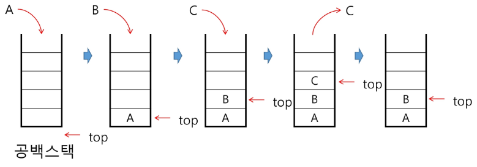

# APS(Algorithm Problem Solving) 기본

## Stack 1

### 스택

#### 스택의 특성

- 물건을 쌓아올리듯 자룔르 쌓아 올린 형태의 자료구조이다.
- 스택에 저장된 자료는 선형 구조를 갖는다.
  - 선형구조: 자료 간의 관계가 1대 1의 관계를 갖는다.
  - 비선형구조: 자료 간의 관계가 1대 N의 관계를 갖는다. (예: 트리)
- 스택에 자료를 삽입하거나 스택에서 자료를 꺼낼 수 있다.
- 마지막에 삽입한 자료를 가장 먼저 꺼낸다.
  - 후입선출(LIFO, Last-In_First_Out) 이라고 부른다.
  - 예를 들어 스택에 1,2,3 순으로자료를 삽입한 후 꺼내면 역순으로, 즉 3,2,1 순으로 꺼낼 수 있다.

#### 스택을 프로그램에서 구현하기 위해서 필요한 자료구조와 연산

- 자료구조 : 자료를 선형으로 저장할 저장소
- 배열을 사용할 수 있다.
- 저장소 자체를 스택이라 부르기도 한다.
- 스택에서 마지막 삽입된 원소의 위치를 top이라 부른다.
- 연산
  - 삽입 : 저장소에 자료를 저장한다. 보통 push라고 부른다.
  - 삭제 : 저장소에서 자료를 꺼낸다. 꺼낸 자료는 삽입한 자료의 역순으로 꺼낸다. 보통 pop이라 부른다.
  - 스택이 공백인지 아닌지를 확인하는 연산. isEmpty
  - 스택의 top에 있는 item(원소)을 반환하는 연산. peek

#### 스택의 삽입/삭제 과정

빈 스택에 원소 A, B, C를 차례로 삽입 후 한번 삭제하는 연산과정


#### 스택의 push 알고리즘

- append 메소드를 통해 리스트의 마지막에 데이터를 삽입
  ```py
  def push(item):
    s.append(item)
  ```

```py
def push(item, size):
    global top
    top+=1
    if top==size:
        print('overflow!')
    else:
        stack[top]=item

size=10
stack = [0]*size
top=-1

push(10,size)
top+=1
stack[top]=20
```

#### 스택의 pop 알고리즘

```py
def pop():
    if len(s)==0:
        # underflow
        return
    else:
        return s.pop()
```

```py
def pop():
    global top
    if top == -1:
        print('underflow')
        return 0
    else:
        top -= 1
        return stack[top+1]

print(pop())

if top > -1:
    top -= 1
    print(stack[top+1])
```

### 스택의 응용

#### 스택 구현 고려사항

- 1차원 배열을 사용하여 구현할 경우 구현이 용이하다는 장접이 있지만 스택의 크기를 변경하기가 어렵다는 단점이 있다.
- 이를 해결하기 위한 방법으로 저장소를 동적을 할당하여 스택을 구현하는 방법이 있다.<br>동적 연결리스트를 이용하여 구현하는 방법을 의미한다.<br>구현이 복잡하다는 단점이 있지만 메모리를 효율적으로 사용한다는 장점을 가진다.

## 재귀호출

- 필요한 함수가 자신과 같은 경우 자신을 다시 호출하는 구조
- 함수에서 실행해야 하는 작업의 특성에 따라 일반적인 호출방식보다 재귀호출방식을 사용하여 함수를 만들면 프로그램의 크기를 줄이고 간단하게 작성

  - ex) factorial
    n에 대한 factorial : 1부터 n까지의 모든 자연수를 곱하여 구하는 연산

    ```
    n! = n x (n-1)!
        (n-1)! = (n-1) x (n-2)!
        (n-2)! = (n-2) x (n-3)!
        ...
        2! = 2 x 1!
        1! = 1
    ```

    마지막에 구한 하위값을 이용하여 상위 값을 구하는 작업을 반복

### 피보나치 수열

- 0과 1로 시작하고 이전 두 수의 합을 다음 항으로 하는 수열을 피보나치라 한다.
- 피보나치 수열의 a번째 값을 계산하는 함수 F를 정의하면 다음과 같다.
  - F₀ = 0, F₁ = 1
  - Fₐ=Fₐ₋₁ + Fₐ₋₂ for i ≥2

```py
def fibo(n):
    if n < 2:
        return n
    else:
        return fibo(n-1)+fibo(n-2)
```

#### 모든 배열 원소에 접근하기

```py
def f(i,N):
    if i == N:
        return
    else:
        print(arr[i])
        f(i+1,N)
```

#### 배열에 v가 있으면 1, 없으면 0을 리턴

```py
def f(i,N,v):
    if i == N: return 0
    elif arr[i]==v: return 1
    else: f(i+1,N,v)
```
