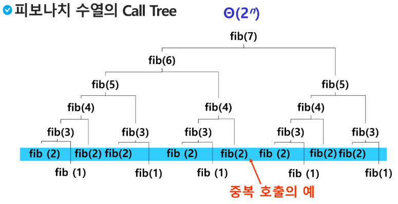
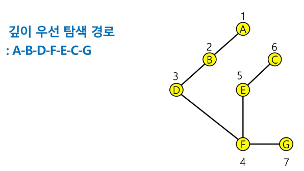

# APS(Algorithm Problem Solving) 기본

## Stack 1

### 피보나치 수열

```py
def fibo(n):
    if n < 2:
        return n
    else:
        return fibo(n-1)+fibo(n-2)
```

#### 모든 배열 원소에 접근하기

```py
def f(i,N):
    if i == N:
        return
    else:
        print(arr[i])
        f(i+1,N)
```

#### 배열에 v가 있으면 1, 없으면 0을 리턴

```py
def f(i,N,v):
    if i == N: return 0
    elif arr[i]==v: return 1
    else: f(i+1,N,v)
```

- 앞의 예에서 피보나치 수를 구하는 함수를 재귀함수로 구현한 알고리즘은 엄청난 중복호출이 존재하는 문제점이 있다.
  

### Memoization

- 메모이제이션은 컴퓨터 프로그램을 실행할 때 이전에 계산한 값을 메모리에 저장해서 매번 다시 계산하지 않도록 하여 전체적인 실행속도를 빠르게 하는 기술이다. 동적 계획법의 핵심이 되는 기술이다.
- 메모리에 넣기 라는 뜻으로 memorization과 혼동 X
- 앞의 예에서 피보나치 수를 구하는 알고리즘에서 fibo(n)의 값을 계산하자마자 저장하면(memoize) 실행시간을 Θ(n)으로 줄일 수 있다.

```py
def fibo1(n):
    global memo
    if n >= 2 and memo[n] == 0:
        memo[n] = fibo1(n-1) + fibo1(n-2)
    return memo[n]

memo = [0]*(n+1)
memo[0] = 0
memo[1] = 1
```

### DP(Dynamic Programming)

- 동적 계획 알고리즘은 그리디 알고리즘과 같이 최적화 문제를 해결하는 알고리즘이다.
- 먼저 입력 크기가 작은 부분 문제들을 모두 해결한 후에 그 해들을 이용하여 보다 큰 크기의 부분 문제들을 해결하여, 최종적으로 원래 주어진 입력의 문제를 해결하는 알고리즘이다.
- 피보나치 수 DP 적용
  1. 문제를 부분문제로 분할한다.
     - Fibonacci(n) 함수는 Fibonacci(n-1)과 Fibonacci(n-2)의 합
     - Fibonacci(n1) 함수는 Fibonacci(n-2)과 Fibonacci(n-3)의 합
     - ....
  2. 부분 문제로 나누는 일을 끝냈으면 가장 작은 부분 문제부터 해를 구한다.
  3. 그 결과는 테이블에 저장하고, 테이블에 저장된 부분 문제의 해를 이용하여 상위 문제의 해를 구한다.

```py
def fibo2(n):
    f = [0] * (n+1)
    f[0], f[1] = 0, 1
    for i in range(2, n+1):
        f[i] = f[i-1]+ f[i-2]
    return f[n]
```

### DFS(깊이우선탐색)

- 비선형 구조인 그래프 구조는 그래프로 표현된 모든 자료를 빠짐없이 검색하는 것이 중요함
- 2가지 방법
  - 깊이 우선 탐색(Depth First Search, DFS)
  - 너비 우선 탐색(Breadth First Search, BFS)
- 시작 정점의 한 방향으로 갈 수 있는 경로가 있는 곳까지 깊이 탐색해 가다가 더 이상 갈 곳이 없게 되면, 가장 마지막에 만났던 갈림길 간선이 있는 정점으로 되돌아와서 다른 방향의 정점으로 탐색을 계속 반복하여 결국 모든 정점을 방문하는 순회 방법
- 가장 마지막에 만났던 갈림길의 정점으로 되돌아가서 다시 깊이 우선 탐색을 반복해야 하므로 후입선출 구조의 스택 또는 재귀함수 사용

```c++
visited[], stack[] 초기화
DEF(v)
    시작점 v방문;
    visited[v] <- true;
    while{
        if (v의 인접 정점 중 방문 안 한 정점 w가 있으면)
            push(v);
            v <- w;
            visited[w] <- true;
        else
            if (스택이 비어 있지 않으면)
                v <- pop(stack):
            else
                break
    }
end DFS()
```

```py
def DFS(s, V):            # s 시작 정점, V 정점 개수(1번부터인 정점의 마지막 정점)
    visited = [0]*(V+1)   # 방문한 정점을 표시
    stack = []            # 스택 생성
    result = []
    visited[s] = 1        # 시작정점 방문 표시
    v = s
    result.append(str(v))
    while True:
        for w in adjL[v]:   # v에 인접하고 방문 안 한 w가 있으면,
            if visited[w] == 0:
                stack.append(v)     # push(v) 현재 정점을 push하고
                v = w               # w에 방문
                visited[w] = 1      # w에 방문 표시
                result.append(str(v))
                break               # v부터 다시 탐색
        else:                       # 남은 인접 정점이 없어서 break가 걸리지 않은 경우
            if stack:               # 이전 갈림길을 스택에서 꺼내서 ... if TOP > -1
                v = stack.pop()
            else:       # 되돌아갈 곳이 없으면 남은 갈림길이 없으면 탐색 종료
                break   # while True:
    return result

if __name__ == '__main__':
    V, E = map(int, input().split())
    adjL = [[] for _ in range(V+1)]
    arr = list(map(int, input().split()))
    for i in range(E):
        v1, v2 = arr[i*2], arr[i*2+1]
        adjL[v1].append(v2)
        adjL[v2].append(v1)

    print(f'#1 {"-".join(DFS(1, V))}')
```



```py
for a in ax:
    print(a)
    if a == x:
        break
else:
    print("break하면 else문이 실행?")
```

python은 for문에 else 사용가능
