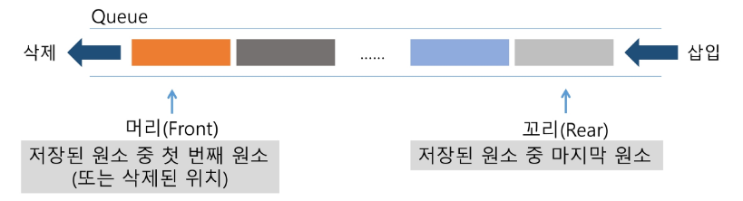
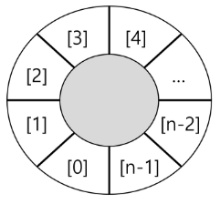
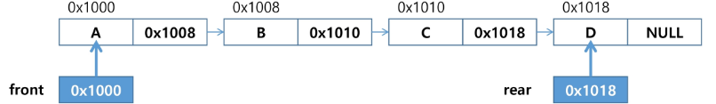
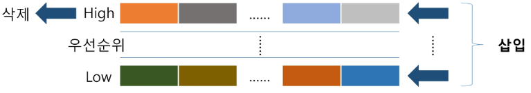

# APS(Algorithm Problem Solving) 기본

## Queue 1

### 큐

#### 큐의 특성

- 스택과 마찬가지로 삽입과 삭제의 위치가 제한적인 자료구조
  - 큐의 뒤에서는 삽입만 하고, 큐의 앞에서는 삭제만 이루어지는 구조
- 선입선출구조(FIFO : First In First Out)
  - 큐에 삽입한 순서대로 원소가 저장되어, 가장 먼저 삽입(First In)된 원소는 가장 먼저 삭제(First Out)된다.
    
- 큐의 기본 연산

  - 삽입 : enQueue
  - 삭제 : deQueue

    |     연산      |                        기능                         |
    | :-----------: | :-------------------------------------------------: |
    | enQueue(item) |     큐의 뒤쪽(rear 다음)에 원소를 삽입하는 연산     |
    |   deQueue()   | 큐의 앞쪽(front)에서 원소를 삭제하고 반환하는 연산  |
    | createQueue() |           공백 상태의 큐를 생성하는 연산            |
    |   isEmpty()   |          큐가 공백상태인지를 확인하는 연산          |
    |   isFull()    |          큐가 포화상태인지를 확인하는 연산          |
    |    Qpeek()    | 큐의 앞쪽(front)에서 원소를 삭제 없이 반환하는 연산 |

#### 큐의 연산 과정

1. 공백 큐 생성 : createQueue();

   []

2. 원소 A 삽입 : enQueue(A);

   [A]

3. 원소 B 삽입 : enQueue(B);

   [A, B]

4. 원소 반환/삭제 : deQueue();

   A [B]

5. 원소 C 삽입 : enQueue(C);

   A [B, C]

6. 원소 반환/삭제 : deQueue();

   A, B [C]

7. 원소 반환/삭제 : deQueue();

   A, B, C []

```py
N = 10
q = [0] * N
front = -1
rear = -1

rear += 1  # enqueue()
q[rear] = 1
rear += 1  # enqueue()
q[rear] = 2
rear += 1  # enqueue()
q[rear] = 3

front += 1  # dequeue()
print(q[front]) # 1
front += 1  # dequeue()
print(q[front]) # 2
front += 1  # dequeue()
print(q[front]) # 3

q2 = []
q2.append(10)
q2.append(20)
print(q2.pop(0))    # 10
print(q2.pop(0))    # 20
```

### 큐의 구현

#### 삽입 : enQueue(item)

- 마지막 원소 뒤에 새로운 원소를 삽입하기 위해

  1. rear 값 하나 중가시켜 새로운 원소를 삽입할 자리를 마련
  2. 그 인덱스에 해당하는 배열원소 Q[rear]에 item을 저장

```py
def enQueue(item):
    global rear
    if isFull():print("Queue_Full")
    else:
        rear += 1
        Q[rear] = item
```

#### 삭제 : deQueue()

- 가장 앞에 있는 원소를 삭제하기 위해

  1. front 값 하나 중가시켜 큐에 남아있는 첫 번째 원소 이동
  2. 새로운 첫 번째 원소를 리턴 함으로써 삭제와 동일한 기능함

```py
def deQueue():
    global front
    if isEmpty():print("Queue_Empty")
    else:
        front += 1
        return Q[front]
```

#### 공백상태 및 포화상태 검사 : isEmpty(), isFull()

- 공백상태 : front == rear
- 포화상태 : rear == n-1 (n:배열의 크기, n-1:배열의 마지막 인덱스)

```py
def isEmpty(): return front == rear
def isFull(): return rear == len(Q)-1
```

#### 검색 : Qpeek()

- 가장 앞에 있는 원소를 검색하여 반환하는 연산
- 현재 front의 한자리 뒤(front+1)에 있는 원소, 즉 큐의 첫 번째에 있는 원소를 반환

```py
def Qpeek():
    if isEmpty():print("Queue_Empty")
    else:return Q[front+1]
```

### 선형 큐 이용시의 문제점

#### 잘못된 포화상태 인식

- 선형 큐를 이용하여 원소의 삽입과 삭제를 계속할 경우, 배열의 앞부분에 활용할 수 있는 공간이 있음에도 불구하고, rear=n-1인 상태 즉, 포화상태로 인식하여 더 이상의 삽입을 수행하지 않게 됨

#### 해결방법 - 원소 이동

- 매 연산이 이루어질 때 마다 저장된 원소들을 배열의 앞부분으로 모두 이동시킴
- 원소 이동에 많은 시간이 소요되어 큐의 효율성이 급격히 떨어짐

#### 해결방법 - 원형 큐

- 1차원 배열을 사용하되, 논리적으로는 배열의 처음과 끝이 연결되어 원형 형태의 큐를 이룬다고 가정하고 사용
  

### 원형 큐의 구조

- 초기 공백 상태: front = rear = 0
- index의 순환은 나머지 연산자 mod 사용
- 공백 상태와 포화 상태 구분을 쉽게 하기 위해 front가 있는 자리는 사용하지 않고 항상 빈자리로 둠

  |        |        삽입 위치        |         삭제 위치         |
  | :----: | :---------------------: | :-----------------------: |
  | 선형큐 |     rear = rear + 1     |     front = front + 1     |
  | 원형큐 | rear = (rear + 1) mod n | front = (front + 1) mod n |

### 원형 큐의 구현

#### 초기 공백 큐 생성

- 크기 n인 1차원 배열 생성
- front와 rear를 0으로 초기화

#### 공백상태 및 포화상태 검사 : isEmpty(), isFull()

- 공백상태 : front == rear
- 포화상태 : 삽입할 rear의 다음 위치 == 현재 front
  - (rear + 1) mod n == front

```py
def isEmpty(): return front == rear
def isFull(): return (rear+1) % len(cQ) == front
```

#### 삽입 : enQueue(item)

- 마지막 원소 뒤에 새로운 원소를 삽입하기 위해

  1. rear 값을 조정하여 새로운 원소를 삽입할 자리를 마련:
     <br>rear = (rear + 1) mod n
  2. 그 인덱스에 해당하는 배열원소 cQ[rear]에 item을 저장

```py
def enQueue(item):
    global rear
    if isFull():print("Queue_Full")
    else:
        rear = (rear + 1) % len(cQ)
        cQ[rear] = item
```

#### 삭제 : deQueue()

- 가장 앞에 있는 원소를 삭제하기 위해

  1. front 값을 조정하여 삭제할 자리를 준비함
  2. 새로운 front 원소를 리턴 함으로써 삭제와 동일한 기능함

```py
def deQueue():
    global front
    if isEmpty():print("Queue_Empty")
    else:
        front = (front + 1) % len(cQ)
        return cQ[front]
```

```py
Q_SIZE = 4
cQ = [0]*Q_ZISE
front = rear = 0

rear = (rear+1)%Q_SIZE
cQ[rear] = 1

rear = (rear+1)%Q_SIZE
cQ[rear] = 2

rear = (rear+1)%Q_SIZE
cQ[rear] = 3

front = (front+1)%Q_SIZE
print(cQ[front])

front = (front+1)%Q_SIZE
print(cQ[front])

front = (front+1)%Q_SIZE
print(cQ[front])

rear = (rear+1)%Q_SIZE
cQ[rear] = 10

rear = (rear+1)%Q_SIZE
cQ[rear] = 20

rear = (rear+1)%Q_SIZE
cQ[rear] = 30
```

### 연결 큐의 구조

#### 단순 연결 리스트(Linked List)를 이용한 큐

- 큐의 원소 : 단순 연결 리스트의 노드
- 큐의 원소 순서 : 노드의 연결 순서. 링크로 연결되어 있음
- front : 첫 번째 노드를 가리키는 링크
- rear : 마지막 노드를 가리키는 링크

#### 상태 표현

- 초기 상태 : front = rear = null
- 공백 상태 : front = rear = null
  

### 참고 : deque(덱)

- 컨테이너 자료형 중 하나
- 양쪽 끝에서 빠르게 추가와 삭제를 할 수 있는 리스트류 컨테이너

#### 연산

- append(x) : 오른쪽에 x 추가
- popleft() : 왼쪽에서 요소를 제거하고 반환. 요소가 없으면 IndexError

```py
from collections import deque

q=deque()
q.append(1)
t=q.popleft()
```

### 우선순위 큐(Priority Queue)

#### 특성

- 우선순위를 가진 항목들을 저장하는 큐
- FIFO 순서가 아니라 우선순위가 높은 순서대로 먼저 나가게 된다.

#### 적용분야

- 시뮬레이션 시스템
- 네트워크 트래픽 제어
- 운영체제의 테스크 스케쥴링

#### 구현

- 배열을 이용한 우선순위 큐
  - 배열을 이용하여 자료 저장
  - 원소를 삽입하는 과정에서 우선순위를 비교하여 적절한 위치에 삽입하는 구조
  - 가장 앞에 최고 우선순위의 원소가 위치하게 됨
  - 문제점
    - 배열을 사용하므로 삽입이나 삭제가 일어날 때 원소 재배치가 일어나고, 시간과 메모리 낭비가 큼
- 리스트를 이용한 우선순위 큐

#### 기본 연산



### 버퍼

- 데이터를 한 곳에서 다른 한 곳으로 전송하는 동안 일시적으로 그 데이터를 보관하는 메모리 영역
- 버퍼링 : 버퍼를 활용하는 방식 또는 버퍼를 채우는 동작을 의미한다.

#### 버퍼의 자료구조

- 버퍼는 일반적으로 입출력 및 네트워크와 관련된 기능에서 이용된다.
- 순서대로 입력/출력/전달되어야 하므로 FIFO 방식의 자료구조인 큐가 활용된다.
