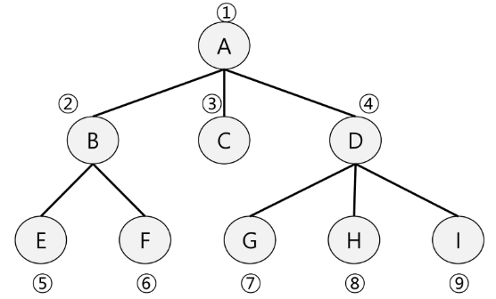
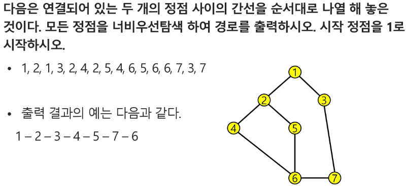

# APS(Algorithm Problem Solving) 기본

## Queue 2

### BFS(Breadth First Search)

- 너비 우선 탐색은 탐색 시작점의 인접한 정점들을 먼저 모두 차례로 방문한 후에, 방문했던 정점을 시작점으로 하여 다시 인접한 정점들을 차례로 방문한 방식
- 인접한 정점들에 대해 탐색한 후, 차례로 다시 너비 우선 탐색을 진행해야 하므로, 선입선출 형태의 자료구조인 큐를 활용함

  

```py
def BFS(G, v):  #그래프 G, 탐색 시작점 v
    visited = [0]*(n+1)  # n : 정점의 개수
    queue = []  # 큐 생성
    queue.append(v)  # 시작점 v를 큐에 삽입
    while queue:  # 큐가 비어있지 않은 경우
        t = queue.pop(0)  # 큐의 첫번째 원소 반환
        if not visited[t]:  # 방문되지 않은 곳이라면
            visited[t] = True  # 방문한 것으로 표시
            print(t)  # 정점 t에서 할 일
            for i in G[t]:  # t와 연결된 모든 정점에 대해
                if not visited[i]:  # 방문되지 않은 곳이라면
                    queue.append(i)  # 큐에 넣기
```

```py
def BFS(G, v, n):  #그래프 G, 탐색 시작점 v
    visited = [0]*(n+1)  # n : 정점의 개수
    queue = []  # 큐 생성
    queue.append(v)  # 시작점 v를 큐에 삽입
    visited[v] = 1
    while queue:  # 큐가 비어있지 않은 경우
        t = queue.pop(0)  # 큐의 첫번째 원소 반환
        print(t)  # 정점 t에서 할 일
        for i in G[t]:  # t와 연결된 모든 정점에 대해
            if not visited[i]:  # 방문되지 않은 곳이라면
                queue.append(i)  # 큐에 넣기
                visited[i] = visited[t] + 1  # n으로부터 1만큼 이동
```



```py
# 7 8
# 1 2 1 3 2 4 2 5 4 6 5 6 6 7 3 7
def bfs(s, V):  # 시작점 s, 마지막 정점 V
    # 준비
    visited = [0]*(V+1)    # visited 생성
    q = []    # 큐 생성
    q.append(s)    # 시작점 인큐
    visited[s] = 1    # 시작점 방문표시
    # 탐색
    while q:    # 탐색할 정점이 남아있으면
        t = q.pop(0)    # t<-디큐
        print(t)    # 처리
        for w in adj_l[t]:    # t에 인접이고, 인큐된 적 없으면
            if visited[w] == 0:
                q.append(w) # 인큐하고 인큐됨 표시
                visited[w] = 1


V, E = map(int, input().split()) # V 마지막 정점 번호, E 간선 수
arr = list(map(int, input().split()))

adj_l = [[] for _ in range(V+1)]
for i in range(E):
    v1, v2 = arr [i*2], arr[i*2+1]
    adj_l[v1].append(v2)
    adj_l[v2].append(v1)  # 방향이 없는 경우

bfs(1, V)  # 출발점, 정점수
```

- 미로 최단경로 찾기

```py
def bfs(i, j, N):
    visited = [[0]*N for _ in range(N)]
    q = []
    q.append([i,j])
    visited[i][j]=1
    while q:
        ti, tj = q.pop(0)
        if maze[ti][tj] == 3:
            return visited[ti][tj] - 1 - 1 # 경로의 빈칸수, -1 추가
        for di, dj in [[0,1],[1,0],[0,-1],[-1,0]]:
            wi, wj = ti+di, tj+dj
            if 0<=wi<N and 0<=wj<N and maze[wi][wj] != 1 and visited[wi][wj] == 0:
                q.append([wi,wj])   # 인큐
                visited[wi][wj] = visited[ti][tj] + 1    # 인큐 표시
    return 0

def find_start(N):
    for i in range(N):
        for j in range(N):
            if maze[i][j]==2:
                return i,j

for t in range(1, int(input())+1):
    N = int(input())
    maze[list(map(int, input())) for _ in range(N)]
    sti, stj = find_start(N)
    ans = bfs(sti, stj, N)
```
