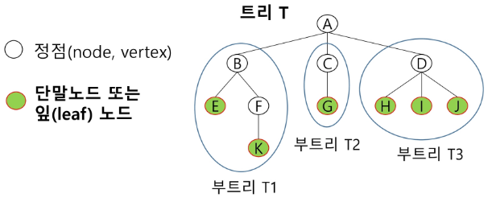
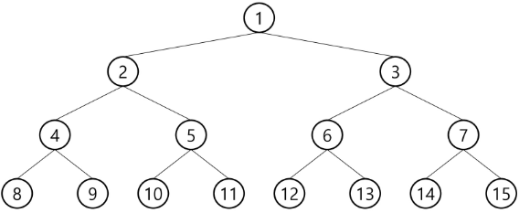
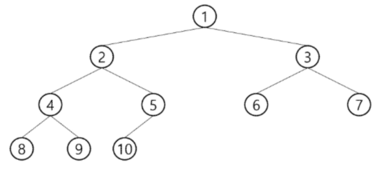
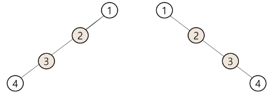

# APS(Algorithm Problem Solving) 기본

## Tree 1

### 트리

#### 트리의 개념

- 비선형 구조
- 원소들 간에 1:N 관계를 가지는 계층구조
- 원소들 간에 계층 관계를 가지는 계층형 자료구조
- 상위 원소에서 하위 원소로 내려가면서 확장되는 트리(나무) 모양의 구조

#### 정의

- 한 개 이상의 노드드롤 이루어진 유한 집합이며 다음조건을 만족한다.
  - 노드 중 최상위 노드를 루트(root)라 한다.
  - 나머지 노드들은 n(>=0)개의 분리 집합 T1,...,TN으로 분리될 수 있다.
- 이들 T1,..., TN은 각각 하나의 트리가 되며(재귀적 정의) 루트의 부 트리(subtree)라 한다.
  

#### 용어정리

- 노드(node) : 트리의 원소
  - 트리 T의 노드 - A, B, C, D, E, F, G, H, I ,J ,K
- 간선(edge) : 노드를 연결하는 선. 부모 노드와 자식 노드를 연결
- 루트 노드(root node) : 트리의 시작 노드
  - 트리 T의 루트노드 - A
- 형제 노드(sibling node) : 같은 부모 노드의 자식 노드들
  - B, C, D는 형제 노드
- 조상 노드 : 간선을 따라 루트 노드까지 이르는 경로에 있는 모든 노드들
  - K의 조상 노드 - F, B, A
- 서브 트리(subtree) : 부모 노드와 연결된 간선을 끊었을 때 생성되는 트리
- 자손 노드 : 서브 트리에 있는 하위 레벨의 노드들
  - B의 자손 노드 - E, F, K
- 차수(degree)
  - 노드의 차수 : 노드에 연결된 자식 노드의 수
    - B의 차수=2, C의 차수=1
  - 트리의 차수 : 트리에 있는 노드의 차수 중에서 가장 큰 값
    - 트리 T의 차수=3
  - 단말 노드(리프 노드) : 차수가 0인 노드. 자식 노드가 없는 노드
- 높이
  - 노드의 높이 : 루트에서 노드에 이르는 간선의 수. 노드의 레벨
    - B의 높이=1, F의 높이=2
  - 트리의 높이 : 트리에 잇는 노드의 높이 중에서 가장 큰 값. 최대 레벨
    - 트리 T의 높이=3

### 이진 트리

- 모든 노드들이 2개의 서브 트리를 갖는 특별한 형태의 트리
- 각 노드가 자식 노드를 최대한 2개까지만 가질 수 있는 트리
  - 왼쪽 자식 노드(left child node)
  - 오른쪽 자식 노드(right child node)

#### 특성

- 레벨 i에서의 노드의 최대 개수는 2ⁱ개
- 높이가 h인 이진 트리가 가질 수 있는 노드의 최소 개수는 (h+1)개가 되며, 최대 개수는 (2ʰ⁺¹-1)개가 된다.

#### 종류

- 포화 이진 트리(Full Binary Tree)

  - 모든 레벨에 노드가 포화상태로 차 있는 이진 트리
  - 높이가 h일 때, 최대의 노드 개수인 (2ʰ⁺¹-1)의 노드를 가진 이진 트리
    - 높이 3일 때 2³⁺¹-1 = 15개의 노드
  - 루트를 1번으로 하여 2ʰ⁺¹-1까지 정해진 위치에 대한 노드 번호를 가짐
    

- 완전 이진 트리(Complete Binary Tree)

  - 높이가 h이고 노드 수가 n개일 때(단, 2ʰ ≤ n ≤ 2ʰ⁺¹-1), 포화 이진 트리의 노드 번호 1번부터 n번까지 빈 자리가 없는 이진 트리
  - 예> 노드가 10개인 완전 이진 트리
    

- 편향 이진 트리(Skewed Binary Tree)
  - 높이 h에 대한 최소 개수의 노드를 가지면서 한쪽 방향의 자식 노드만을 가진 이진 트리
    - 왼쪽 편향 이진 트리
    - 오른쪽 편향 이진 트리
      

### 이진 트리의 표현

### 이진 트리의 저장

### 연습문제

### 이진 탐색 트리

### 힙
