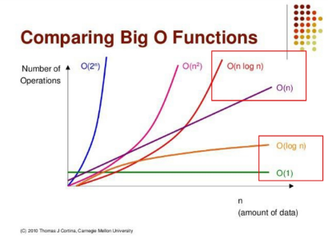

# APS(Algorithm Problem Solving) 응용

## 시작하기 1

### SW 문제 해결

#### SW 문제 해결 역량

- 프로그램을 하기 위한 많은 제약조건과 요구사항을 이해하고 최선의 방법을 찾아내는 능력
- 프로그래머가 사용하는 언어나 라이브러리, 자료구조, 알고리즘에 대한 지식을 적재적소에 퍼즐을 배치하듯 이들을 연결하여 큰 그림을 만드는 능력이라 할 수 있다.
- 문제 해결 역량은 추상적인 기술.
  - 프로그래밍 언어, 알고리즘처럼 명확히 정의된 실체가 없다.
  - 무작정 알고리즘을 암기하고 문제를 풀어본다고 향상 X
  - 역량 향상을 위해선 훈련이 필요.

#### 문제 해결 과정

1. 문제를 읽고 이해
2. 문제를 익숙한 용어로 재정의
3. 어떻게 해결할지 계획
   - 자료구조
   - 알고리즘
4. 계획을 검증
5. 프로그램으로 구현
6. 풀이방법 복기 후 개선 방법 찾기

#### 리스트에 숫자 넣기

- 수 N을 입력받는다.
- 윗 줄에는 N부터 1씩 증가되는 숫자 4개를 왼쪽에 채운다.
- 아랫 줄에는 N부터 1씩 감소되는 숫자 4개를 오른쪽에 채운다.
- 최종결과를 출력한다. 빈 공간은 0으로 출력한다.

설계 예시

- 1\. 2X7 크기의 0으로 채운 리스트 준비
- 2\. 수 N 입력받기

- 3-A. 리스트의 [0]번째 내부 리스트에는 k 인덱스에 N+k값 넣고 리스트의 [1]번째 내부 리스트에는 7-k 인덱스에 N-k값 넣기 (for k in range(4))

OR

- 3-1. t1=N대입 후, for 4번 돌려 T1값을 리스트에 넣기 range(0, 4)
- 3-2. t2=N대입 후, for 4번 돌려 T2값을 리스트에 넣기 range(6, 2, -1)

- 4\. 리스트 출력

#### 정리

- SW 문제를 잘 풀기 위한 전략
  - 단계 1 : 완벽한 문제 이해
  - 단계 2 : 종이와 펜을 이용한 설계 (어떻게 구현할 지 계획)
  - 단계 3 : 설계 한대로 구현 & 디버깅

### 복잡도 분석

#### 알고리즘?

- (명) 알고리즘 ; 유한한 단계를 통해 문제를 해결하기 위한 절차나 방법.<br>주로 컴퓨터 용어로 쓰이며, 컴퓨터가 어떤 일을 수행하기 위한 단계적 방법을 말함.
- 간단하게 말하면 어떤 문제를 해결하기 위한 절차.

#### 알고리즘의 효율

- 공간적 효율성과 시간적 효율성
  - 공간적 효율성 ; 연산량 대비 얼마나 적은 메모리 공간을 요하는가
  - 시간적 효율성 ; 연산량 대비 얼마나 적은 시간을 요하는가
  - 효율성을 뒤집어 표현하면 복잡도(Complexity)가 된다. 복잡도가 높을수록 효율성은 저하된다.

#### 복잡도의 점근적 표기

- 시간(공간) 복잡도는 입력 크기에 대한 함수로 표기하는데, 이 함수는 주로 여러개의 항을 가지는 다항식이다.
- 이를 단순한 함수로 표현하기 위해 점근적 표기(Asymptotic Notation)를 사용한다.
- 입력 크기 n이 무한대로 커질 때의 복잡도를 간단히 표현하기 위해 사용하는 표기법이다.
- O(Big-Oh) 표기
- Ω(Big-Omega) 표기
- Θ(Big-Theta) 표기

#### O(Big-Oh) 표기

- O-표기는 복잡도의 점근적 상한을 나타낸다.
- 복잡도가 f(n)=2n²-7n+4이라면, f(n)의 O-표기는 O(n²)이다.
- 먼저 f(n)의 단순화된 표현은 n²이다.
- 단순화된 함수 n² 에 임의의 상수 c를 곱한 cn²이 n이 증가함에 따라 f(n)의 상한이 된다. (단 c>0)
- 대략적인 지표만 계산 가능하다.
- 미세하게 비교하고 싶을 경우 강조해서 적을 수 있다.
  - 알고리즘을 미세하게 비교할 때:
    > 기존 알고리즘 성능이 O(7N)이지만, 제가 짠 알고리즘 성능은 O(2N)으로 더 좋은 성능을 냅니다.

구현이 오래 걸리지만(5분) O(N)인 경우와 구현이 바로 되지만(1초) O(N²)인 경우

- N값과 구현 시간에 따라서 상황에 맞게 선택
- 만약 N이 10,000이라면 O(N)은 1만번, O(N²)은 1억번 반복



- O(logN)은 O(1)보다는 느리지만, 유사한 성능
- O(NlogN)은 O(N)보다는 느리지만, 유사한 성능

#### 정리

- 왜 효율적인 알고리즘이 필요한가?

| O(n²)  | 1,000 | 1백만 | 10억  |
| :----: | :---: | :---: | :---: |
|   PC   | < 1초 | 2시간 | 300년 |
| 슈퍼컴 | < 1초 |  1초  | 1주일 |

| O(nlogn) | 1,000 | 1백만 | 10억  |
| :------: | :---: | :---: | :---: |
|    PC    | < 1초 | < 1초 |  5분  |
|  슈퍼컴  | < 1초 |  1초  | < 1초 |

- 효율적인 알고리즘은 슈퍼컴퓨터보다 더 큰 가치가 있다.

- 대략 1초당 3000만번

### 진수

#### 2진수, 8진수, 10진수, 16진수

- 10진수 : 사람이 사용하는 진수, 수 하나를 0~9로 표현
- 2진수 : 컴퓨터를 사용하는 진수, 수 하나를 0,1로 표현
- 8진수 : 2진수를 더 가독성 있게 사용
- 16진수 : 2진수를 더 가독성 있게 사용, 수 하나를 0, 1, ... , 8, 9, A, B, C, D, E, F로 표현
- (168)₁₀ = (1010 1000)₂ = (250)₈ = (A8)₁₆

#### 왜 16진수를 사용?

- 2진수를 사람이 이해하기 편하도록, 10진수로 변환 시 <br>-> 인간이 이해하기 편하지만, 연산이 오래걸림
- 2진수를 사람이 이해하기 편하도록, 16진수로 변환 시 <br>-> 인간이 이해하기 어렵지만, 연산속도가 매우 빠름

#### 용어

- HEX : 16진수
- DEC : 10진수
- OCT : 8진수
- BIN : 2진수

#### 변환

- DEC -> BIN

```py
def dec_to_bin(n):
    result=[]
    while n:
        result.append(n%2)
        n//=2
    result.reverse()
    print(*result)
```

- DEC -> HEX

```py
H=[0,1,2,3,4,5,6,7,8,9,'A','B','C','D','E','F']

def dec_to_hex(n):
    result=[]
    while n:
        result.append(H[n%16])
        n//=16
    result.reverse()
    print(*result)
```
