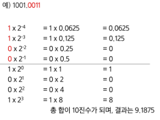

# APS(Algorithm Problem Solving) 응용

## 시작하기 1

### 비트 연산

#### 비트와 바이트

- 1 bit : 0과 1을 표현하는 정보의 단위
- 1 Byte : 8 bit를 묶어 1 Byte라고 한다.

#### 비트연산

- 컴퓨터의 CPU는 0과 1로 다루어 동작되며, 내부적으로 비트 연산을 사용하여 덧셈, 뺄셈, 곱셈 등을 계산한다.

#### 비트연산자

- a AND b : a, b 둘 다 1일때만 결과가 1이다. 그 외에는 0
- a OR b : a, b 둘 중 하나만 1이면 결과가 1이다. 그 외에는 0
- a ^ b : XOR 연산자, OR 처럼 동작되는데 둘 다 1인경우는 0이다.
- Left Shift << : 특정 수 만큼 비트를 왼쪽으로 밀어낸다.
- Right Shift >> : 특정 수 만큼 비트를 오른쪽으로 밀어낸다. (우측 비트들이 제거된다.)
- (~) NOT 연산자 : 모든 비트를 반전시킨다.

| 연산자 |                  연잔자의 기능                  |
| :----: | :---------------------------------------------: |
|   &    |          비트 단위로 AND 연산을 한다.           |
|   \|   |           비트 단위로 OR 연산을 한다.           |
|   ^    | 비트단위로 XOR 연산을 한다. (같으면 0 다르면 1) |
|   <<   |    피연산자의 비트 열을 왼쪽으로 이동시킨다.    |
|   >>   |   피연산자의 비트 열을 오른쪽으로 이동시킨다.   |
|   ~    |             모든 비트를 반전시킨다.             |

#### 파이썬에서 2진수, 16진수, 10진수 변환하여 출력하기

- 2진수는 숫자 0과 소문자 b -> 0b를 접두사로 붙여 표현한다.
- 16진수는 숫자 0과 소문자 x -> 0x를 접두사로 붙여 표현한다.

#### 비트연산 응용

- 1<<n
  - 2ⁿ의 값을 갖는다.
  - 임베디드 분야에서 계산을 빠르게 하기 위해 사용된다.
- i & (1<<n)
  - i의 n번째 비트가 1인지 아닌지를 확인할 수 있다.

#### 음수 표현 방법

- 컴퓨터는 음수를 "2의 보수"로 관리한다.
- 맨 앞자리 bit(MSB)는 음수 or 양수를 구분하는 비트이다.
- 컴퓨터가 2의 보수를 사용하여 음수를 관리하는 이유
  - 뺄셈의 연산 속도를 올릴 수 있으며, +0과 -0을 따로 취급하지 않기 위해 사용한다.
- 2의 보수 예시
  - 10001의 2의 보수
    - 수를 모두 뒤집고 +1을 한다.
    - ->01110 + 1 = 01111
  - 1111000의 2의 보수
    - 수를 뒤집으면 0000111이고 +1을 하면 0001000이다.
- 2의 보수를 취한 수를 한번 더 2의 보수를 취하면 원래 값으로 돌아온다.

#### -5를 2의 보수로 표현(수를 8비트로 저장)

- 5 -> 0000 0101
- 음수의 MSB는 1
- 나머지 7bit에 대해 수를 뒤집고 1 더하기(2의 보수)
- 수 5를 뒤집으면 111 1010이며, 1을 더하면 111 1011이 된다.
- 따라서 1111 1011이 된다.

### 실수

#### 소수점 출력 방법

- {t:.2f} : t값을 소수점 둘째자리에서 반올림하여 표현

- 파이썬에서는 내부적으로 더 큰 규모의 자료구조를 사용해서 훨씬 넓은 범위의 실수를 표현할 수 있다.
- 최대로 표현할 수 있는 값은 약 1.8 X 10³⁰⁸ 이고 이 이상은 inf로 표현
- 최소로 표현할 수 있는 값은 약 5.0 X 10⁻³²⁴ 이며, 이 이하는 0으로 표현
- 실수는 정확한 값이 아니라 근사 값으로 저장되는데 이때 생기는 작은 오차가 계산 과정에서 다른 결과를 가져온다.

#### 소수점 10진수를 2진수로 변환

```py
2⁻⁵  = 0.03125
2⁻⁴  = 0.0625
2⁻³  = 0.125
2⁻²  = 0.25
2⁻¹  = 0.5
2⁰   = 1
```


