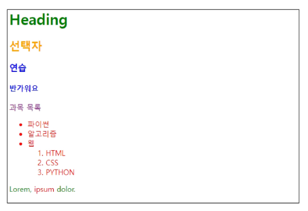
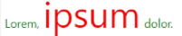
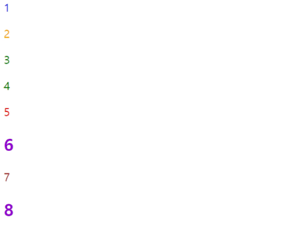

# Web

#### World Wide Web

- 인터넷으로 연결된 컴퓨터들이 정보를 공유한느 거대한 정보 공간

#### Web

- Web site, Web application 등을 통해 사용자들이 정보를 검색하고 상호 작용하는 기술

#### Web site

- 인터넷에서 여러 개의 Web page가 모인 것으로, 사용자들에게 정보나 서비스를 제공하는 공간

#### Web page

HTML, CSS 등의 웹 기술을 이용하여 만들어진, "Web site"를 구성하는 하나의 요소

## 웹 구조화

### HTML

- HyperText Markup Language<br>
  웹 페이지의 의미와 구조를 정의하는 언어
- Hypertext
  - 웹 페이지를 다른 페이지로 연결하는 링크
  - 참조를 통해 사용자가 한 문서에서 다른 문서로 즉시 접근할 수 있는 텍스트
  - 특징
    - 비선형성/상호연결성/사용자 주도적 탐색
- Markup Language
  - 태그 등을 이용하여 문서나 데이터의 구조를 명시하는 언어

### HTML 구조

- `<!DOCTYPE html>`
  - 해당 문서가 html 문서라는 것을 나타냄
- `<html></html>`
  - 전체 페이지의 콘텐츠를 포함
- `<title></title>`
  - 브라우저 탭 및 즐겨찾기 시 표시되는 제목으로 사용
- `<head></head>`
  - HTML 문서에 관련된 설명, 설정 등 컴퓨터가 식별하는 메타데이터를 작성
  - 사용자에게 보이지 않음
- `<body></body>`
  - HTML 문서의 내용을 나타냄
  - 페이지에 표시되는 모든 콘텐츠를 작성
  - 한 문서에 하나의 body 요소만 존재

### HTML Text structure

- HTML의 주요 목적 중 하나는 텍스트 구조와 의미를 제공하는 것
- 대표적인 HTML Text structure
  - Heading & Paragraphs
    - h1~6, p
  - Lists
    - ol, ul, li
  - Emphasis & Importance
    - em, strong

## 웹 스타일링

### CSS

Cascading Style Sheet

- 웹페이지의 디자인과 레이아웃을 구성하는 언어

Cascade

- 계단식
- 한 요소에 동일한 가중치를 가진 선택자가 적용될 때 CSS에서 마지막에 나오는 선언이 사용됨

#### CSS 적용 방법

1. 인라인(Inline) 스타일

   - HTML요소 안에 style 속성 값으로 작성

   ```html
   <!DOCTYPE html>
   <html lang="en">
     <head>
       ...
     </head>
     <body>
       <h1 style="color: blue; background-color: yellow;">Hello World!</h1>
     </body>
   </html>
   ```

2. 내부(Internal) 스타일 시트

   - head 태그 안에 style 태그에 작성

   ```html
   <!DOCTYPE html>
   <html lang="en">
     <head>
       ...
       <title>Document</title>
       <style>
         h1 {
           color: blue;
           background-color: yellow;
         }
       </style>
     </head>
   </html>
   ```

3. 외부(External) 스타일 시트

   - 별도의 CSS 파일 생성 후 HTML link 태그를 사용해 불러오기

   ```html
   <!DOCTYPE html>
   <html lang="en">
     <head>
       ...
       <link rel="stylesheet" href="style.css" />
       <title>Document</title>
     </head>
     <body>
       <h1>Hello World!</h1>
     </body>
   </html>
   ```

   ```css
   /*style.css*/
   h1 {
     color: blue;
     background-color: yellow;
   }
   ```

### CSS Selectors

HTML 요소를 선택하여 스타일을 적용할 수 있도록 하는 선택자

- 기본 선택자
  - 전체(\*) 선택자
    - HTML 모든 요소를 선택
  - 요소(tag) 선택자
    - 지정된 모든 태그를 선택
  - 클래스(class) 선택자
    - 주어진 클래스 속성을 가진 모든 요소를 선택
  - 아이디(id) 선택자
    - 주어진 아이디 속성을 가진 요소 선택
    - 문서에는 주어진 아이디를 가진 요소가 하나만 있어야 함
  - 속성(attr) 선택자 등

```html
<style>
  /*전체 선택자*/
  * {
    color: red;
  }
  /* 타입 선택자 */
  h2 {
    color: orange;
  }
  h3,
  h4 {
    color: blue;
  }
  /* 클래스 선택자 */
  .green {
    color: green;
  }
  /* id 선택자 */
  #purple {
    color: purple;
  }
</style>

<body>
  <h1 class="green">Heading</h1>
  <h2>선택자</h2>
  <h3>연습</h3>
  <h4>반가워요</h4>
  <p id="purple">과목 목록</p>
  <ul class="green">
    <li>파이썬</li>
    <li>알고리즘</li>
    <li>
      웹
      <ol>
        <li>HTML</li>
        <li>CSS</li>
        <li>PYTHON</li>
      </ol>
    </li>
  </ul>
  <p class="green">Lorem, <span>ipsum</span> dolor.</p>
</body>
```



- 결합자 (Combinators)
  - 자손 결합자(" "(space))
    - 첫 번째 요소의 자손 요소들 선택
    - 예> **p sapn**은 `<p>` 안에 있는 모든 `<span>`를 선택 (하위 레벨 상관 없이)
  - 자식 결합자(">")
    - 첫 번째 요소의 직계 자식만 선택
    - ul > li은 `<ul>` 안에 있는 모든 <li>를 선택 (한단계 아래 자식들만)

```html
<style>
  ...
  /* 자식 결합자 */
  .green > span {
    font-size: 50px;
  }
  /* 자손 결합자 */
  .green li {
    color: brown;
  }
</style>

<body>
  ...
  <p class="green">Lorem, <span>ipsum</span> dolor.</p>
</body>
```



### 명시도

Specificity

- 결과적으로 요소에 적용할 CSS 선언을 결정하기 위한 알고리즘
- CSS Selector에 가중치를 계산하여 어떤 스타일을 적용할지 결정
- 동이랗ㄴ 요소를 가리키는 2개 이상의 CSS 규칙이 있는 경우 가장 높은 명시도를 가진 Selector가 승리하여 스타일이 적용됨

```css
h1 {
  color: red;
}
h1 {
  color: purple;
}
```

h1의 태그 내용의 색은 purple이 적용됨

```css
.make-red {
  color: red;
}
h1 {
  color: purple;
}
```

h1의 태그 내용의 색은 red가 적용됨

#### 명시도 우선순위

1. Importance
   - !important
   - 다른 우선순위 규칙보다 우선하여 적용하는 키워드
   - Cascade의 구조를 무시하고 강제로 스타일을 적용하는 방식이므로 권장X
2. Inline 스타일
3. 선택자
   - id 선택자 > class 선택자 > 요소 선택자
4. 소스코드 선언 순서

```html
<style>
  h2 {
    color: darkviolet !important;
  }

  p {
    color: blue;
  }

  .orange {
    color: orange;
  }

  .green {
    color: green;
  }

  #red {
    color: red;
  }
</style>
<body>
  <p>1</p>
  <p class="orange">2</p>
  <p class="green orange">3</p>
  <p class="orange green">4</p>
  <p id="red" class="orange">5</p>
  <h2 id="red" class="orange">6</h2>
  <p id="red" class="orange" style="color: brown;">7</p>
  <h2 id="red" class="orange" style="color: brown;">8</h2>
</body>
```


