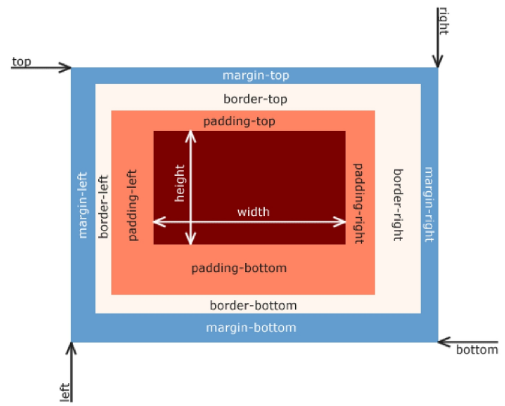
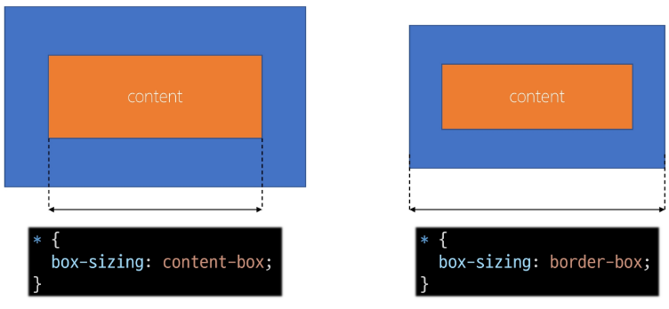

# Web

## CSS Box Model

- 웹 페이지의 모든 HTML 요소를 감싸는 사각형 상자 모델
- 내용(content), 안쪽 여백(padding), 테두리(border), 외부 간격(margin)으로 구성되어 요소의 크기와 배치를 결정

### Box 구성 요소

- Margin
  - 이 박스와 다른 요소 사이의 공백
  - 가장 바깥쪽 영역
- Content
  - 콘텐츠가 표시되는 영역
- Padding
  - 콘텐츠 주위에 위치하는 공백 영역
- Border
  - 콘텐츠와 패딩을 감싸는 테두리 영역
- Content box
  - 실제 콘텐츠가 표시되는 영역 크기
  - width 및 height 속성을 사용하여 크기 조정
- Padding box
  - 콘텐츠 주위의 공백
  - padding 관련 속성을 사용하여 크기 조정
- Border box
  - 콘텐츠와 패딩을 래핑
  - border관련 속성을 사용하여 크기 조정
- Margin box
  - 콘텐츠, 패딩 및 테두리를 래핑
  - 박스와 다른 요소 사이의 공백
  - margin 관련 속성을 사용하여 크기 조정

#### shorthand

- border
  - border-width, border-style, border-color를 한번에 설정
- margin & padding
  - 4방향의 속성을 한번에 지정

#### box-sizing

- 표준 상자 모델에서 width와 height 속성 값을 설정하면 이 값은 content box의 크기를 조정하게 됨
- CSS는 border box가 아닌 content box의 크기를 width 값으로 지정
  

#### 기타 속성

- inline-block
  - inline과 block 요소 사이의 중간 지점을 제공하는 display 값
  - width 및 height 속성 사용 가능
  - padding, margin 및 border로 인해 다른 요소가 상자에서 밀려남
  - 새로운 행으로 넘어가지 않음
- none
  - 요소를 화면에 표시하지 않고, 공간조차 부여되지 않음
