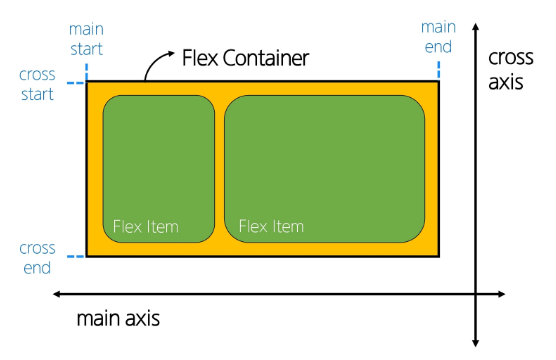
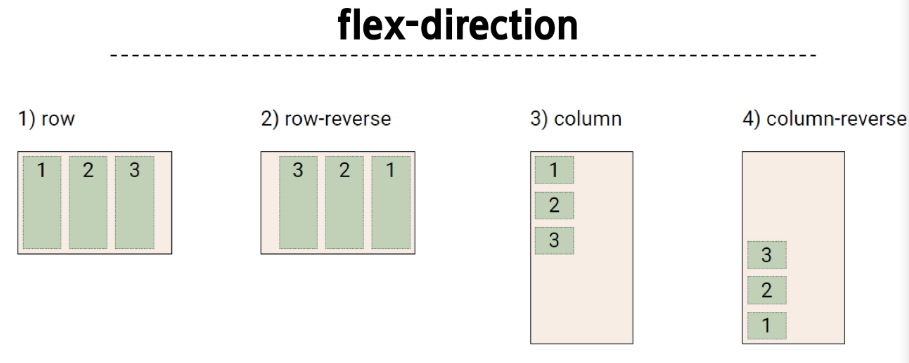
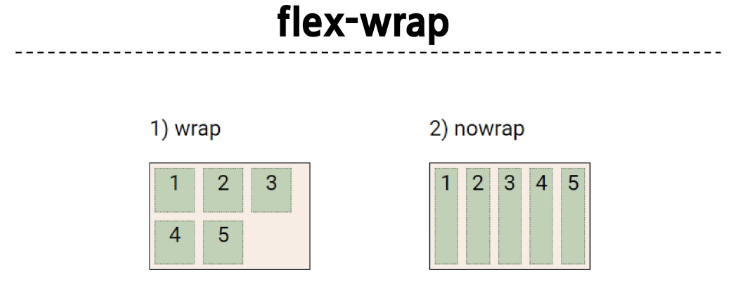
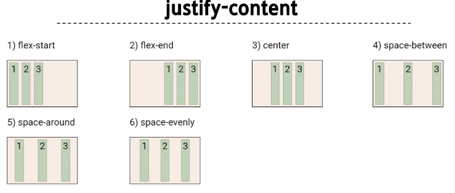
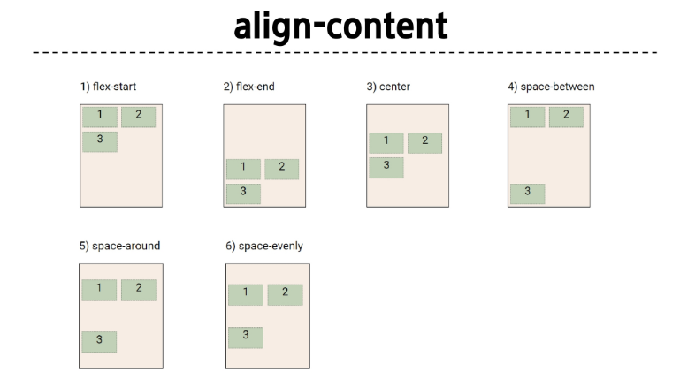
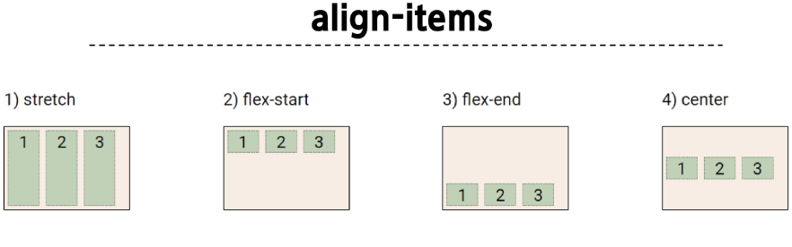
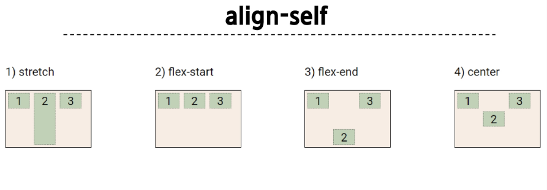

# Web

## CSS Box Model

- 웹 페이지의 모든 HTML 요소를 감싸는 사각형 상자 모델
- 내용(content), 안쪽 여백(padding), 테두리(border), 외부 간격(margin)으로 구성되어 요소의 크기와 배치를 결정

### Box 구성 요소

#### Margin

- 이 박스와 다른 요소 사이의 공백
- 가장 바깥쪽 영역

#### Content

- 콘텐츠가 표시되는 영역

#### Padding

- 콘텐츠 주위에 위치하는 공백 영역

#### Border

- 콘텐츠와 패딩을 감싸는 테두리 영역

#### Content box

- 실제 콘텐츠가 표시되는 영역 크기
- width 및 height 속성을 사용하여 크기 조정

#### Padding box

- 콘텐츠 주위의 공백
- padding 관련 속성을 사용하여 크기 조정

#### Border box

- 콘텐츠와 패딩을 래핑
- border관련 속성을 사용하여 크기 조정

#### Margin box

- 콘텐츠, 패딩 및 테두리를 래핑
- 박스와 다른 요소 사이의 공백
- margin 관련 속성을 사용하여 크기 조정


#### shorthand

- border
  - border-width, border-style, border-color를 한번에 설정
- margin & padding
  - 4방향의 속성을 한번에 지정

#### box-sizing

- 표준 상자 모델에서 width와 height 속성 값을 설정하면 이 값은 content box의 크기를 조정하게 됨
- CSS는 border box가 아닌 content box의 크기를 width 값으로 지정
  

#### 기타 속성

- inline-block
  - inline과 block 요소 사이의 중간 지점을 제공하는 display 값
  - width 및 height 속성 사용 가능
  - padding, margin 및 border로 인해 다른 요소가 상자에서 밀려남
  - 새로운 행으로 넘어가지 않음
- none
  - 요소를 화면에 표시하지 않고, 공간조차 부여되지 않음

## CSS Position

요소를 Normal Flow에서 제거하여 다른 위치로 배치하는 것

- 다른 요소 위에 올리기, 화면의 특정 위치에 고정시키기 등

### Position 유형

1. static

   - 요소를 Normal Flow에 따라 배치
   - top, right, bottom, left 속성이 적용되지 않음
   - 기본 값

2. relative

   - 요소를 Normal Flow에 따라 배치
   - 자신의 원래 위치(static)을 기준으로 이동
   - top, right, bottom, left 속성으로 위치를 조정
   - 다른 요소의 레이아웃에 영향을 주지 않음(요소가 차지하는 공간은 static 일 때와 같음)

3. absolute

   - 요소를 Normal Flow에서 제거
   - 가장 가까운 relative 부모 요소를 기준으로 이동
     - 만족하는 부모 요소가 없다면 body태그를 기준으로 함
   - top, right, bottom, left 속성으로 위치를 조정
   - 문서에서 요소가 차지하는 공간이 없어짐

4. fixed

   - 요소를 Normal Flow에서 제거
   - 현재 회면영역(viewport)을 기준으로 이동
   - 스크롤해도 항상 같은 위치에 유지됨
   - top, right, bottom, left 속성으로 위치를 조정
   - 문서에서 요소가 차지하는 공간이 없어짐

5. sticky
   - relative와 fixed의 특성을 결합한 속성
   - 스크롤 위치가 임계점에 도달하기 전에는 relative처럼 동작
   - 스크롤이 특정 임계점에 도달하면 fixed처럼 동작하여 화면에 고정됨
   - 만약 다음 sticky 요소가 나오면 다음 sticky 요소가 이전 sticky 요소의 자리를 대체
     - 이전 stick 요소가 고정되어 있던 위치와 다음 sticky 요소가 고정되어야 할 위치가 겹치기 때문

### z-index

- 요소의 쌓임 순서(stack order)를 정의하는 속성
- 정수 값을 사용해 Z축 순서를 지정
- 값이 클수록 요소가 위에 쌓이게 됨
- static이 아닌 요소에만 적용됨

#### 특징

- 기본값은 auto
- 부모 요소의 z-index 값에 영향을 받음
- 같은 부모 내에서만 z-index 값을 비교
- 부모의 z-index가 낮으면 자식의 z-index가 아무리 높아도 부모보다 위로 올라갈 수 없음
- z-index 값이 같으면 HTML 문서 순서대로 쌓임

### Position의 목적

전체 페이지에 대한 레이아웃을 구성하는 것보다는 페이지 특정 항목의 위치를 조정하는 것

## CSS Flexbox

요소를 행과 열 형태로 배치하는 1차원 레이아웃 방식

- 공간배열 & 정렬

### Flexbox 구성 요소



#### main axis (주 축)

- flex item들이 배치되는 기본 축
- main start에서 시작하여 main end 방향으로 배치 (기본 값)

#### cross axis (교차 축)

- main axis에 수직인 축
- cross start에서 시작하여 cross end 방향으로 배치 (기본 값)

#### Flex Container

- displayL flex; 혹은 display: inline-flex; 가 설정된 부모 요소
- 이 컨테이너의 1차 자식 요소들이 Flex Item이 됨
- flexbox 속성 값들을 사용하여 자식 요소 Flex Item들을 배치하는 주체

#### Flex Item

- Flex Container 내부에 레이아웃 되는 항목

### Flexbox 속성

- Flex Container 관련 속성
  - display, flex-direction, flex-wrap, justify-content, align-items, align-content
- Flex Item 관련 속성
  - align-self, flex-grow, flex-basis, order

1. Flex Container 지정

   - flex item은 기본적으로 행(주 축의 기본값인 가로방향)으로 나열
   - flex item은 주 축의 시작 선에서 시작
   - flex item은 교차 축의 크기를 채우기 위해 늘어남

2. flex-direction

   - flex item이 나열되는 방향을 지정
   - cloumn으로 지정할 경우 주 축이 변경됨
   - "-reverse"로 지정하면 flex item 배치의 시작 선과 끝 선이 바뀜

3. flex-wrap

   - flex-item 목록이 flex container의 한 행에 들어가지 않을 경우 다른 행에 배치할지 여부 설정

4. justify-content

   - 주 축을 따라 flex item과 주위에 공간을 분배

5. align-content

   - 교차 축을 따라 flex item과 주위에 공간을 분배
     - flex-wrap이 wrap 또는 wrap-reverse로 설정된 여러 행에만 적용됨
     - 한줄짜리 행에는 효과 없음(flex-wrap이 nowrap일 때)

6. align-items

   - 교차 축을 따라 flex item 행을 정렬

7. align-self

   - 교차 축을 따라 개별 flex item을 정렬

8. flex-grow

- 남는 행 여백을 비율에 따라 각 flex item에 분배
  - 아이탬이 컨테이너 내에서 확장하는 비율을 설정
- flex-grow의 반대는 flex-shrink

9. flex-basis
   - flex item의 초기 크기 값을 지정
   - flex-basis와 width 값을 동시에 적용한 경우 flex-basis가 우선

#### flex-wrap 응용

반응형 레이아웃

- 다양한 디바이스와 화면 크기에 자동으로 적응하여 콘텐츠를 최적으로 표시하는 웹 레이아웃 방식
- justify-items 및 justify-self 속성이 필요 없는 이유
  - margin auto를 통해 정렬 및 배치가 가능

## 참고

### 마진 상쇄

Margin collapsing

- 두 block 타입 요소의 margin top과 bottom이 만나 더 큰 margin으로 결합되는 현상

#### 이유

- 복잡한 레이아웃에서 요소 간 간격을 일관되게 유지하기 위함
- 요소 간의 간격을 더 예측 가능하고 관리하기 쉽게 만듦
- 일관성, 단순화

### 박스 타입 별 수평 정렬

#### Block

- margin: auto 사용
  - 블록 요소의 너비를 지정하고 좌우 마진을 auto로 설정

#### Inline

- text-align 사용
  - 부모 요소에 적용

#### Inline-block

- text-align 사용
  - 부모 요소에 적용

### Flexbox Shorthand 속성

#### flex-flow

```css
.container {
  flex-flow: flex-direction flex-wrap;
}
```

#### flex

```css
* {
  /* One value, unitless number: flex-grow */
  flex: 2;
  /* One value, length or percentage: flex-basis */
  flex: 10rem;
  flex: 30%;
  /* Two values: flex-grow | flex-basis */
  flex: 1 30px;
  /* Two values: flex-grow | flex-shrink */
  flex: 2 2;
  /* Three values: flex-grow | flex-shrink | flex-basis */
  flex: 2 2 10%;
}
```







