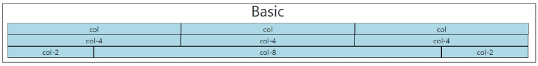
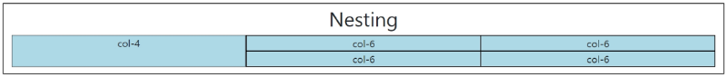
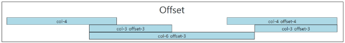
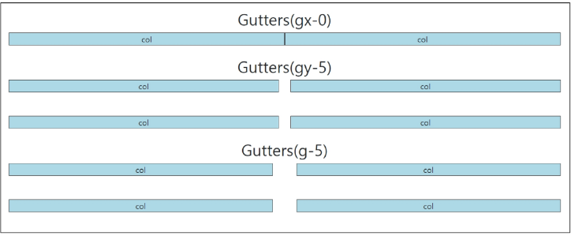
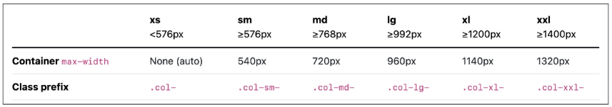

# Web

#### emmet

```html
div.container
<div class="container"></div>

ul>li*3
<ul>
  <li></li>
  <li></li>
  <li></li>
</ul>

ul>li.item$*5
<ul>
  <li class="item1"></li>
  <li class="item2"></li>
  <li class="item3"></li>
  <li class="item4"></li>
  <li class="item5"></li>
</ul>

nav>ul.menu>li*5>a[href='#']{메뉴 $}
<nav>
  <ul class="menu">
    <li><a href="#">메뉴 1</a></li>
    <li><a href="#">메뉴 2</a></li>
    <li><a href="#">메뉴 3</a></li>
    <li><a href="#">메뉴 4</a></li>
    <li><a href="#">메뉴 5</a></li>
  </ul>
</nav>
```

## Responsive Web

### Bootstrap Grid System

- 웹 페이지의 레이아웃을 조정하는데 사용되는 12개 컬럼으로 구성된 시스템

#### 목적

- 반응형 디자인을 지원해 웹 페이지를 모바일, 태블릿, 데스크탑 등 다양한 기기에서 적저랗게 표시할 수 있도록 도움

#### 반응형 웹 디자인

- 디바이스 종류나 화면 크기에 상관없이, 어디서든 일관된 레이아웃 및 사용자 경험을 제공하는 디자인 기술

#### Grid System 기본 요소

1. Container
   - Column들을 담고 있는 공간
2. Column
   - 실제 컨텐츠를 포함하는 부분
3. Gutter
   - 컬럼과 컬럼 사이의 여백 영역
   - Grid System에서 column 사이에 여백 영역
   - x축은 padding, y축은 margin으로 여백 생성



```html
<h2 class="text-center">Basic</h2>
<div class="container">
  <div class="row">
    <div class="box col">col</div>
    <div class="box col">col</div>
    <div class="box col">col</div>
  </div>
  <div class="row">
    <div class="box col-4">col-4</div>
    <div class="box col-4">col-4</div>
    <div class="box col-4">col-4</div>
  </div>
  <div class="row">
    <div class="box col-2">col-2</div>
    <div class="box col-8">col-8</div>
    <div class="box col-2">col-2</div>
  </div>
</div>
```



```html
<h2 class="text-center">Nesting</h2>
<div class="container">
  <div class="row">
    <div class="box col-4">col-4</div>
    <div class="box col-8">
      <div class="row">
        <div class="box col-6">col-6</div>
        <div class="box col-6">col-6</div>
        <div class="box col-6">col-6</div>
        <div class="box col-6">col-6</div>
      </div>
    </div>
  </div>
</div>
```



```html
<h2 class="text-center">Offset</h2>
<div class="container">
  <div class="row">
    <div class="box col-4">col-4</div>
    <div class="box col-4 offset-4">col-4 offset-4</div>
  </div>
  <div class="row">
    <div class="box col-3 offset-3">col-3 offset-3</div>
    <div class="box col-3 offset-3">col-3 offset-3</div>
  </div>
  <div class="row">
    <div class="box col-6 offset-3">col-6 offset-3</div>
  </div>
</div>
```



```html
<h2 class="text-center">Gutters(gx-0)</h2>
<div class="container">
  <div class="row gx-0">
    <div class="col-6">
      <div class="box">col</div>
    </div>
    <div class="col-6">
      <div class="box">col</div>
    </div>
  </div>
</div>

<br />

<h2 class="text-center">Gutters(gy-5)</h2>
<div class="container gy-5">
  <div class="row">
    <div class="col-6">
      <div class="box">col</div>
    </div>
    <div class="col-6">
      <div class="box">col</div>
    </div>
    <div class="col-6">
      <div class="box">col</div>
    </div>
    <div class="col-6">
      <div class="box">col</div>
    </div>
  </div>
</div>

<br />

<h2 class="text-center">Gutters(g-5)</h2>
<div class="container">
  <div class="row g-5">
    <div class="col-6">
      <div class="box">col</div>
    </div>
    <div class="col-6">
      <div class="box">col</div>
    </div>
    <div class="col-6">
      <div class="box">col</div>
    </div>
    <div class="col-6">
      <div class="box">col</div>
    </div>
  </div>
</div>
```

### Grid System for Responsive Web

Bootstrap Grid System에서는 12개 column과 6개 breakpoints를 사용하여 반응형 웹 디자인을 구현

#### Grid System Breakpoints

웹 페이지를 다양한 화면 크기에서 적절하게 배치하기 위한 분기점

- 화면 너비에 따라 6개의 분기점 제공(xs, sm, md, lg, xl, xxl)



- 각 breakpoints마다 설정된 최대 너비 값 이상으로 화면이 커지면 grid system 동작이 변경됨

### 종합 정리

- CSS 레이아웃 기술들은 각각 고유한 특성과 장단점을 가지고 있음
- 이들은 상호보완적이며, 특정 상호아에 따라 적합한 도구가 달라짐
- 최적의 기술을 선택하고 효과적으로 활용하기 위해서는 다양한 실제 개발 경험이 필수적

## UX & UI

### UX

User Experience

- 제품이나 서비스를 사용하는 사람들이 느끼는 전체적인 경험과 만족도를 개선하고 최적화하기 위한 디자인과 개발분야

ex>

- 백화점 1층에서 느껴지는 좋은 향수 향기
- 러쉬 매장 근처의 러쉬 향기
- 원하는 음악을 검색할 때, 적절한 검색 동작과 정확한 검색 결과

- UX 설계
  - 사람들의 마음과 생각을 이해하고 정리해서 제품에 녹여내는 과정
  - 유저 리서치, 데이터 설계 및 정제, 유저 시나리오, 프로토타입 설계

### UI

User Interface

- 서비스와 사용자 간의 상호작용을 가능하게 하는 디자인 요소들을 개발하고 구현하는 분야

ex>

- 리모컨 ; 사용자가 버튼을 누르면 TV가 켜지고, 채널을 변경하거나 볼륨을 조절할 수 있음
- ATM ; 사용자가 터치스크린을 통해 사용자 정보를 입력하고, 원하는 금액을 선택할 수 있음
- 웹사이트 ; 사용자가 로그인 버튼을 누르면, 이동하는 화면의 디자인 및 레이아웃

- UX 설계
  - 예쁜 디자인 보다는 사용자가 더 쉽고 편리하게 사용할 수 있도록 고려
  - 이를 위해서는 디자인 시스템, 중간 산출물, 프로토타입 등이 필요

### 디자이너와 기획자 그리고 개발자

많은 회사에서는 UX/UI 디자인을 함께하는 디자이너를 채용하거나 UX는 기획자, UI는 디자이너의 역할로 채용하기도 함

- UX (직무 : UX Researcher, User Researcher)
  - (구글) 사용자의 경험을 이해하기 위한 통계 모델을 설계
  - (MS) 리서치를 기획하고 사용자에 대한 지표를 정의
  - (Meta) 정성적인 방법과 정량적인 방법을 사용해서 사용자 조사를 실시
- UI (직무 : Product Designer, Interaction Designer)
  - (구글) 다양한 디자인 프로토타이핑 툴을 사용해서 개발 가이드를 제공
  - (MS) 시각 디자인을 고려해서 체계적인 디자인 컨셉을 보여줌
  - (Meta) 제품을 이해하고 더 나은 UI Flow와 사용자 경험을 디자인

## 참고

### The Grid System

- CSS가 아닌 편집 디자인에서 나온 개념으로 구성 요소를 잘 배치해서 시각적으로 좋은 결과물을 만들기 위함
- 기본적으로 안쪽에 있는 요소들의 오와 열을 맞추는 것에서 기인
- 정보 구조와 배열을 체계적으로 작성하여 정보의 질서를 부여하는 시스템

### 기업별 UI Design Guidelines

- [삼성 One UI](https://developer.samsung.com/one-ui)
- [애플 UI](https://developer.apple.com/kr/design/tips)

### Can't Unsee

더 나은 UX/UI를 고민해볼 수 있는 웹 게임
[Can't Unsee](https://cantunsee.space/)
