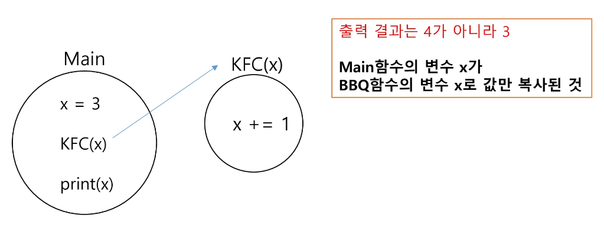

# APS(Algorithm Problem Solving) 응용

## 완전 검색

### 반복(Iteration)과 재귀(Recursion)

- 반복과 재귀는 유사한 작업을 수행할 수 있다.
- 반복은 수행하는 작업이 완료될 때까지 계속 반복
  - 루프(for, while)
  - 반복문은 코드를 n번 반복시킬 수 있다.
- 재귀는 주어진 문제의 해를 구하기 위해 동일하면서 더 작은 문제의 해를 이용하는 방법
  - 하나의 큰 문제를 해결할 수 있는 더 작은 문제로 쪼개고 결과들을 결합

반복문으로는 N번 반복을 구현할 수 있고, 재귀호출로는 n 중 for문을 구현할 수 있다.

#### 재귀를 연습하기 전 알아야 할 함수의 특징

- KFC 함수를 호출할 때, int타입 객체를 전달하면 값만 복사가 된다.
- 아래 예시에서, main 함수의 x와 KFC 함수의 x는 서로 다른 객체이다.
  

### 순열

### 완전 탐색
