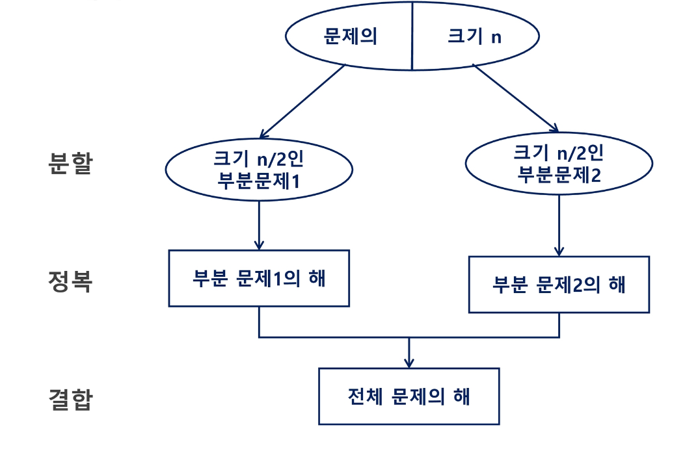
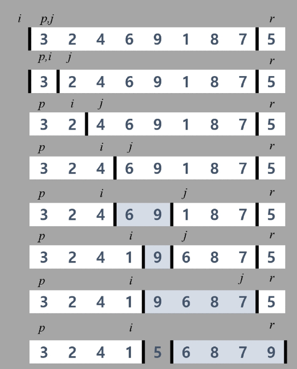
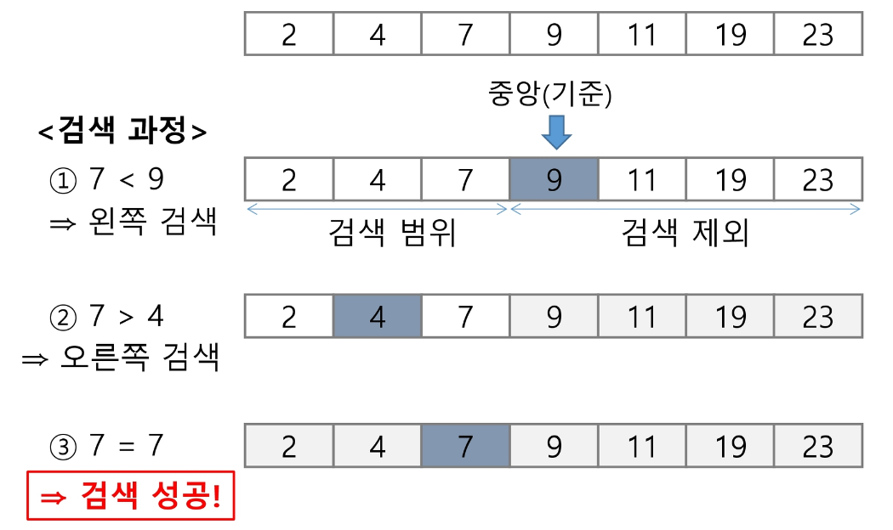

# APS(Algorithm Problem Solving) 응용

## 분할 정복

### 분할 정복

#### 유래

- 1805년 12월 2일 아우스터리츠 전투에서 나폴레옹이 사용한 전략
- 전력이 우세한 연합군을 공격하기 위해 나폴레옹은 연합군의 중앙부로 쳐들어가 연합군을 둘로 나눔
- 둘로 나뉜 연합군을 한 부분씩 격파함

#### 설계 전략

- 분할(Divide) : 해결할 문제를 여러 개의 작은 부분으로 나눈다.
- 정복(Conquer) : 나눈 작은 문제를 각각 해결한다.
- 통합(Combine) : (필요하다면) 해결된 해답을 모은다.
- Top-down_approach 예시
  - 더 이상 분할 할 수 없을 때까지 or 필요 없을 때까지 계속 분할
    

#### 기법 예시

- 거듭제곱

  - 자연수 C의 n 제곱 값을 구하는 함수
  - 반복 알고리즘 O(N)

    ```c++
    Iterative_Power(x, n)
        result <-1

        For i in 1->n
            result<-result*x

        RETURN result
    ```

  - 분할 정복 기반의 알고리즘 O(log₂N)
    ```c++
    Recursive_Power(x, n)
        IF n == 1: RETURN x
        IF n is even
            y <- Recursive_Power(x, n/2)
            RETURN y * y
        ELSE
            y <- Recursive_Power(x, (n-1)/2)
            RETURN y * y * x
    ```

### 병합 정렬

- 여러 개의 정렬된 자료의 집합을 병합하여 한 개의 정렬된 집합으로 만드는 방식
- 분할정복 알고리즘 활용
  - 자료를 최소 단위의 문제까지 나눈 후에 차례대로 정렬하여 최종 결과를 얻어냄
  - top-down 방식
- 시간 복잡도 O(NlogN)

#### 과정

1. 전체 자료 집합에 대하여, 최소 크기의 부분집합이 될 때까지 분할 작업을 계속한다.
2. 2개의 부분집합을 정렬하면서 하나의 집합으로 병합한다.

#### 분할

```py
merge_sort(LIST m)
    IF length(m) == 1: REATURN m

    LIST left, right
    middle <- length(m) / 2
    FOR x in m before middle
        add x to left
    FOR x in m after or equal middle
        add x to right

    left <- merge_sort(left)
    right <- merge_sort(right)

    RETURN merge(left, right)
```

```py
def merge_sort(arr):
    if len(arr) <= 1:
        return arr
    mid = len(arr) // 2
    left = arr[:mid]
    right = arr[mid:]
    left = merge_sort(left)
    right = merge_sort(right)
    return merge(left, right)
```

#### 병합

```py
merge(LIST left, LIST right)
    LIST result

    WHILE length(left) > 0 OR length(right) > 0
        IF length(left) > 0 AND length(right) > 0
            IF first(left) <- first(right)
                append popfirst(left) to result
            ELSE
                append popfirst(right) to result
        ELIF length(left) > 0
            append popfirst(left) to result
        ELIF length(right) > 0
            append popfirst(right) to result
    RETURN result
```

```py
def merge(left, right):
    result = []
    i = j = 0
    while i < len(left) and j < len(right):
        if left[i] < right[j]:
            result.append(left[i])
            i += 1
        else:
            result.append(right[j])
            j += 1
    result += left[i:]
    result += right[j:]
    return result
```

#### 예시 코드

```py
def merge_sort(m):
    # 리스트의 길이가 1이면 이미 정렬된 상태이므로 그대로 반환
    if len(m) == 1:
        return m

    # 리스트를 절반으로 나누기 위해 중간 인덱스를 계산
    mid = len(m) // 2
    left = m[:mid]  # 리스트의 앞쪽 절반
    right = m[mid:]  # 리스트의 뒤쪽 절반

    # 재귀적으로 왼쪽 부분과 오른쪽 부분을 정렬
    left = merge_sort(left)
    right = merge_sort(right)

    # 두 개의 정렬된 리스트를 병합하여 반환
    return merge(left, right)


def merge(left, right):
    # 두 리스트를 병합할 결과 리스트를 초기화
    result = [0] * (len(left) + len(right))
    l = r = 0  # 왼쪽 리스트와 오른쪽 리스트의 인덱스

    # 두 리스트를 순차적으로 비교하여 작은 값을 결과 리스트에 추가
    while l < len(left) and r < len(right):
        if left[l] < right[r]:
            result[l + r] = left[l]
            l += 1
        else:
            result[l + r] = right[r]
            r += 1

    # 왼쪽 리스트에 남은 요소들을 결과 리스트에 추가
    while l < len(left):
        result[l + r] = left[l]
        l += 1

    # 오른쪽 리스트에 남은 요소들을 결과 리스트에 추가
    while r < len(right):
        result[l + r] = right[r]
        r += 1

    # 병합된 결과 리스트를 반환
    return result


arr = [69, 10, 30, 2, 16, 8, 31, 22]
arr = merge_sort(arr)
print(arr)
```

### 퀵 정렬

- 주어진 배열을 두 개로 분할하고, 각각을 정렬
- 병합정렬은 그냥 두 부분으로 나누는 반면, 퀵정렬은 기준 아이템을 중심으로 분할
  - 기준보다 작은 것은 왼편, 큰 것은 오른편에 위치
- 각 부분정렬이 끝난 후, 병합정렬은 병합하는 후처리 필요, 퀵정렬은 필요 X
- 평균 시간복잡도 O(nlogn)
- 평균적으로 매우 빠르다.

#### Partitioning

1. 작업영역 정하기
2. 작업 영역 중 가장 왼쪽에 있는 수를 Pivot(기준)으로 정함
3. 파티셔닝 ; Pivot을 기준으로 왼쪽에는 Pivot보다 작은 수를 배치한다. 오른쪽은 Pivot보다 큰 수를 배치한다. (둘 다 정렬 X)
   - 작업영역에 혼자이면 해당 값 바로 Fix하고 종료
4. 파티셔닝이 끝나고 Pivot의 위치는 확정(Fix)
5. 반복하여 정렬

#### 의사코드

```py
quickSort(A[], l, r)
    if l < r
        s <- partition(a, l, r)
        quickSort(A[], l, s-1)
        quickSort(A[], s+1, r)
# hoare_partition
partition(A[], l, r)
    p <- A[l]
    i <- l, j <- r
    WHILE i ≤ j
        WHILE i ≤ j and A[i] ≤ p : i++
        WHILE i ≤ j and A[i] ≥ p : j--
        IF i < j : swap(A[i], A[j])

    swap(A[l], A[j])
    RETURN j
# Lomuto_partition
partition(A[], p, r)
    x <- A[r]
    i <- p - 1

    FOR j in p -> r - 1
        IF A[j] ≤ x
            i++, swap(A[i], A[j])

    swap(A[i+1], A[r])
    RETURN i + 1
```

- Lomuto_Partition
  - 같은 수가 많을 때 swap이 매우 많이 일어남
  - 역순 정렬된 데이터에선 최악
    

#### 아이디어

- P값드보다 큰 값은 오른쪽, 작은 값들은 왼쪽 집합에 위치
- 피봇을 두 집합의 가운데에 위치

### 이진 검색

- 이진 검색을 하기 위해서는 자료가 정렬된 상태여야 한다.
- 자료의 가운데에 있는 항목의 키 값과 비교하여 다음 검색의 위치를 결정하고 검색을 계속 진행하는 방법
  - 목적 키를 찾을 때 까지 이진 검색을 순환적으로 반복 수행함으로써 검색 범위를 반으로 줄여가면서 보다 빠르게 검색을 수행

#### 검색 과정

1. 자료의 중앙에 있는 원소를 고른다.
2. 중앙 원소의 값과 찾고자 하는 목표 값을 비교한다.
3. 목표 값이 중앙원소의 값보다 작으면 자료의 왼쪽 반에 대해서 새로 검색을 수행하고, 크다면 오른쪽 반에 대해서 새로 검색을 수행한다.
4. 원하는 값을 찾을 때까지 1~3 과정을 반복한다.



#### 반복 구조

```py
binarySearch(n, S[], key)
    low <- 0
    high <- n - 1

    WHILE low <= high
        mid <- low + (high - low) / 2

        IF S[mid] == key
            REATURN mid
        ELIF S[mid] > key
            high <- mid - 1
        ELSE
            low <- mid + 1
    RETURN - 1
```

#### 재귀 구조

```py
binarySearch(a[], low, high, key)
    IF low > high
        RETURN-1
    ELSE
        mid (low + high) / 2
        IF key == a[mid]
            RETURN mid
        ELIF key < a[mid]
            RETURN binarySearch (a[], low, mid 1, key)
        ELSE
            RETURN binarySearch (a[], mid + 1, high, key)
```

### 정리

#### 병합 정렬

- 외부 정렬(External Sort)의 기본이 되는 정렬 알고리즘
- 멀티코어(Multi-Core) CPU나 다수의 프로세서에서 정렬 알고리즘을 병렬화하기 위해 병합 정렬 알고리즘이 활용된다.

#### 퀵 정렬

- 매우 큰 입력 데이터에 대해서 좋은 성능을 보이는 알고리즘이다.

#### 이진 검색

- 정렬된 데이터를 기준으로 특정 값이나 범위를 검색하는 데 사용
- Lower Bound, Upper Bound
  - 정렬된 배열에서 특정 값 이상(이하)가 처음으로 나타나는 위치를 찾는 알고리즘
  - 특정 데이터의 범위 검색 등에서 활용
