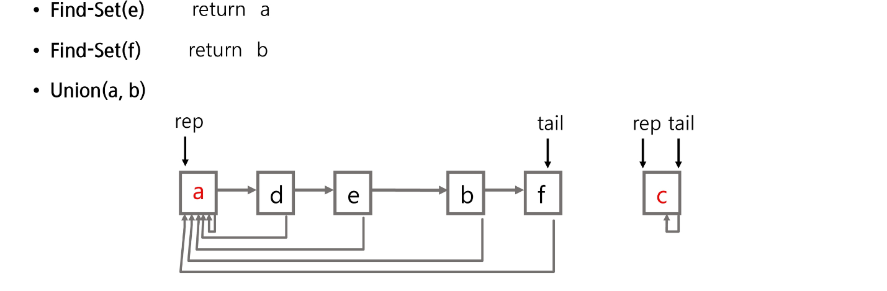

# APS(Algorithm Problem Solving) 응용

## 그래프 기본과 탐색

### 그래프 기본

- 그래프는 아이템(사물 또는 추상적 개념)들과 이들 사이의 연결 관계를 표현한다.
- 그래프는 정점(Vertex)들의 집합과 이들을 연결하는 간선(Edge)들의 집합으로 구성된 자료구조
  - |V|: 정점의 개수, |E|: 그래프에 포함된 간선의 개수
  - |V|개의 정점을 가지는 그래프는 최대 |V|\*(|V|-1)/2 간선이 가능
  - 5개의 정점이 있는 그래프의 최대 간선 수는 10(=5\*4/2)개이다.
- 선형 자료구조나 트리 자료구조로 표현하기 어려운 N:N 관계를 가지는 원소들을 표현하기에 용이하다.

#### 그래프 유형

- 무향 그래프(Undirected Graph)
- 유향 그래프(Directed Graph)
- 가중치 그래프(Weighted Graph)
- 사이클 없는 방향 그래프(DAG, Directed Acyclic Graph)
- 완전 그래프
  - 정점들에 대해 가능한 모든 간선들을 가진 그래프
- 부분 그래프
  - 원래 그래프에서 일부 정점이나 간선을 제외한 그래프

#### 인접 정점

- 인접(Adjacency)
  - 두 개의 정점에 간선이 존재(연결됨)하면 서로 인접해 있다고 한다.
  - 완전 그래프에 속한 임의의 두 정점들을 모두 인접해 있다.

#### 그래프 경로

- 간선들을 순서대로 나열한 것
- 경로 중 한 정점을 최대한 한번만 지나는 경로를 단순 경로라 한다.
- 시작한 정점에서 끝나는 경로를 사이클이라 한다.

#### 그래프 표현

- 간선의 정보를 저장한느 방식, 메모리나 성능을 고려해서 결정
- 인접 행렬(Adjacent matrix)
  - |V| \* |V| 크기의 2차원 배열을 이용해서 간선 정보를 저장
  - 배열의 배열(포인터 배열)
- 인접 리스트(Adjacent List)
  - 각 정점마다 해당 정점으로 나가는 간선의 정보를 저장
- 간선의 배열
  - 간선(시작 정점, 끝 정점)을 배열에 연속적으로 저장

#### 인접 행렬

- 두 정점을 연결하는 간선의 유무를 행렬로 표현
  - |V| \* |V| 정방 행렬
  - 행번호와 열번호는 그래프의 정점에 대응
  - 두 정점이 인접되어 있으면 1, 그렇지 않으면 0으로 표현
  - 무향 그래프
    - i번째 행의 합, i번째 열의 합 = Vᵢ의 차수
  - 유향 그래프
    - 행 i의 합 = Vᵢ의 진출 차수
    - 열 i의 합 = Vᵢ의 진입 차수

### DFS

- 시작 정점의 한 방향으로 갈 수 있는 경로가 있는 곳까지 깊이 탐색해 가다가 더 이상 갈 곳이 없게 되면, 가장 마지막에 만났던 갈림길 간선이 있는 정점으로 되돌아와서 다른 방향의 정점으로 탐색을 계속 반복하여 결국 모든 정점을 방문하는 순회방법
- 가장 마지막에 만났던 갈림길의 정점으로 되돌아가서 다시 깊이 우선탐색을 반복해야 하므로 후입선출 구조의 스택 사용

- DFS 알고리즘 - 재귀

  ```cpp
  DFS_Recursive(G, v)

  visited[v] <- TRUE // v 방문 설정

  FOR each all w in adjacency(G, v)
      IF visited[w] != TRUE
          DFS_Recursive(G, w)
  ```

- DFS 알고리즘 - 반복

  ```cpp
  STACK s
  visited[ ]
  DFS(v)
      push(s,v)
      WHILE NOT isEmpty(s)
          v <- pop(s)
          IF NOT visited[v]
              visit(v)
              FOR each w in adjacency(v)
                  IF NOT visited[w]
                      push(s,w)
  ```

#### 연습문제

- 다음은 연결되어 있는 두 개의 정점 사이의 간선을 순서대로 나열 해 놓은 것이다. 모든 정점을 깊이 우선 탐색하여 화면에 깊이 우선 탐색 경로를 출력하시오. 시작 정점을 1로 시작하시오.

  - 1, 2, 1, 3, 2, 4, 2, 5, 4, 6, 5, 6, 6, 7, 3, 7

  - 출력 결과의 예는 다음과 같다.

  - 1-2-4-6-5-7-3
  - 1-3-7-6-5-2-4

```py
# page25. 연습문제1
import sys
sys.stdin = open("graph.txt", "r")


def dfs(node):
    print(node, end=' ')  # 현재 노드 출력

    # 갈 수 있는 노드들을 탐색
    for next_node in graph[node]:
        if visited[next_node]:
            continue

        visited[next_node] = 1
        dfs(next_node)


N, M = map(int, input().split())
graph = [[] for _ in range(N + 1)]
visited = [0] * (N + 1)
for _ in range(M):
    s, e = map(int, input().split())
    graph[s].append(e)
    graph[e].append(s)

visited[1] = 1
dfs(1)
```

- graph.txt

```t
7 8
1 2
1 3
2 4
2 5
4 6
5 6
6 7
3 7
```

### BFS

- 너비 우선 탐색은 탐색 시작점의 인접한 정점들을 먼저 모두 차례로 방문한 후에, 방문했던 정점을 시작점으로 하여 다시 인접한 정점들을 차례로 방문하는 방식
- 인접한 정점들에 대해 탐색을 한 후, 차례로 다시 너비 우선 탐색을 진행해야 하므로, 선입선출 형태의 자료구조인 큐를 활용함.
- BFS는 예제 드래프를 붙여진 번호 순서로 탐색함

- 입력 파라미터: 그래프 G와 탐색 시작점 v
  ```cpp
  BFS(G,v) // 그래프 G, 탐색 시작점 v
  큐 생성
  시작점 v를 큐에 삽입
  점 v를 방문한 것으로 표시
  WHILE 큐가 비어있지 않은 경우
      t <- 큐의 첫번째 원소 반환
      FOR t와 연결된 모든 선에 대해
          u <- t의 이웃점
          u가 방문되지 않은 곳이면,
          u를 큐에 넣고, 방문한 것으로 표시
  ```

#### 연습문제

- 다음은 연결되어 있는 두 개의 정점 사이의 간선을 순서대로 나열 해 놓은 것이다. 모든 정점을 너비 우선 탐색하여 화면에 너비 우선 탐색 경로를 출력하시오. 시작 정점을 1로 시작하시오.

  - 1, 2, 1, 3, 2, 4, 2, 5, 4, 6, 5, 6, 6, 7, 3, 7

  - 출력 결과의 예는 다음과 같다.

  - 1-2-3-4-5-7-6

```py
# page31. 연습문제2
import sys
sys.stdin = open("graph.txt", "r")


def bfs(node):
    q = [node]

    while q:
        now = q.pop(0)

        print(now, end=' ')  # 현재 노드 출력

        for next_node in graph[now]:
            if visited[next_node]:
                continue

            visited[next_node] = 1
            q.append(next_node)


N, M = map(int, input().split())
graph = [[] for _ in range(N + 1)]
visited = [0] * (N + 1)
for _ in range(M):
    s, e = map(int, input().split())
    graph[s].append(e)
    graph[e].append(s)

visited[1] = 1
bfs(1)
```

- graph.txt

```t
7 8
1 2
1 3
2 4
2 5
4 6
5 6
6 7
3 7
```

### Union-Find(Disjoint set)

#### 서로소 집합

- 서로소 또는 상호배타 집합들은 서로 중복 포함된 원소가 없는 집합들이다. 다시 말해 교집합이 없다.
- 집합에 속한 하나의 특정 멤버를 통해 각 집합들을 구분한다. 이를 대표자(representative)라 한다.

- 상호배타 집합을 표현하는 방법
  - 연결 리스트
  - 트리
- 상호배타 집합 연산

  - Make-Set(x); 초기 설정
  - Find-Set(x); 대표자 찾기
  - Union(x,y); 같은 그룹으로 묶기

- 상호배타 집합 예
  - Make-Set(x); (x)
  - Make-Set(y); (y)
  - Make-set(a); (a)
  - Make-Set(b); (b)
  - Union(x, y); {(x), (y)}
  - Union(a, b); {(a), (b)}
  - Find-Set(y); return x (representative)
  - Find-Set(b); return a (representative)
  - Union(x, a); [{(x), (y)}, {(a), (b)}]

#### 상호 배타 집합 표현 - 연결리스트

- 같은 집합의 원소들은 하나의 연결리스트로 관리한다.
- 연결리스트의 맨 앞의 원소를 집합의 대표 원소로 삼는다.
- 각 원소는 집합의 대표 원소를 가리키는 링크를 갖는다.
  
  
