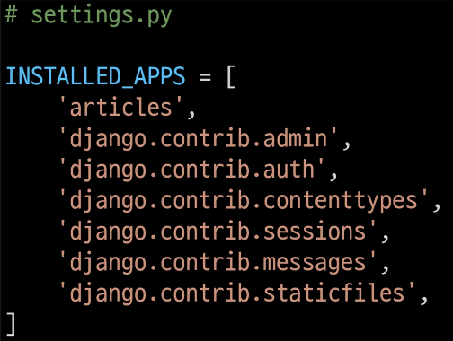
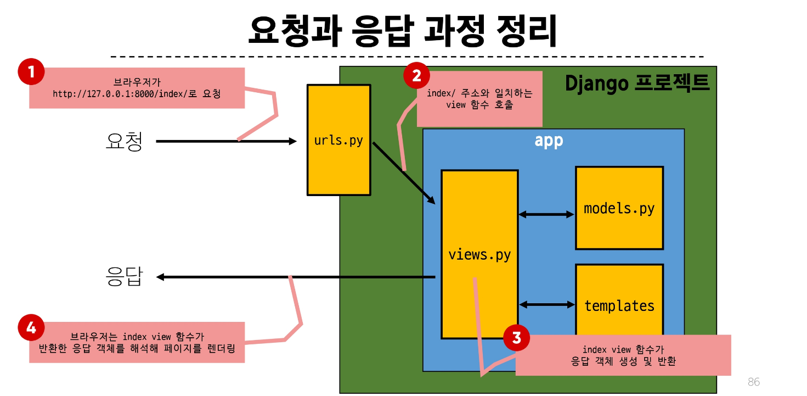

# Django

## Intro

### Web Application

- Web application(web service) 개발
  - 인터넷을 통해 사용자에게 제공되는 소프트웨어 프로그램을 구축하는 과정
  - 다양한 디바이스(모바일, 태블릿, PC 등)에서 웹 브라우저를 통해 접근하고 사용할 수 있음

#### 클라이언트와 서버

- 웹의 동작 방식

```t
        requests-->
  CLIENT           SERVER
        <--responses
```

- Client(클라이언트)
  - 서비스를 요청하는 주체(웹 사용자의 인터넷이 연결된 장치, 웹 브라우저)
- Server(서버)
  - 클라이언트의 요청에 응답하는 주체(웹 페이지, 앱을 저장하는 컴퓨터)

#### Frontend & Backend

- Frontend

  - 사용자 인터페이스(UI)를 구성하고, 사용자가 애플리케이션과 상호작용할 수 있도록 함
  - HTML, CSS, JavaScript, 프론트엔드 프레임워크 등

- Backend

  - 서버측에서 동작하며, 클라이언트의 요청에 대한 처리와 데이터베이스와의 상호작용을 담당
  - 서버언어(Python, Java 등) 및 백엔드 프레임워크, 데이터베이스, API, 보안 등

### Framework

#### Web Framework

- 웹 애플리케이션을 빠르게 개발할 수 있도록 도와주는 친구<br>(개발에 필요한 기본 구조, 규칙, 라이브러리 등을 제공)

#### Django Framework

- Python 기반의 대표적인 웹 프레임워크

##### 사용이유

- 다양성
  - Python 기반으로 웹, 모바일 앱 백엔드, API 서버 및 빅데이터 관리 등 광범위한 서비스 개발에 적합
- 확장성
  - 대량의 데이터에 대해 빠르고 유연하게 확장할 수 있는 기능을 제공
- 보안
  - 취약점으로부터 보호하는 보안 기능이 기본적으로 내장되어 있음
- 커뮤니티 지원
  - 개발자를 위한 지원, 문서 및 업데이트를 제공하는 활성화된 커뮤니티
- 대규모 트래픽 서비스에서도 안정적인 서비스 제공

#### 가상 환경

- Python 애플리케이션과 그에 따른 패키지들을 격리하여 관리할 수 있는 **독립적인** 실행 환경

1. 가상환경 venv 생성
   - venv라는 이름의 가상환경 생성
   - 임의 이름으로 생성이 가능하나 관례적으로 venv 이름을 사용
   ```bash
   python -m venv venv
   ```
2. 가상환경 활성화
   - 활성화 명령어가 OS에 따라 다름에 주의
     - windows
     ```bash
     source venv/Scripts/activate
     ```
     - macOS/Linux
     ```bash
     source venv/bin/activate
     ```
3. 환경에 설치된 패키지 목록 확인
   ```bash
   pip list
   ```
4. 설치된 패키지 목록 생성
   - 현재 Python 환경에 설치된 모든 패키지와 그 버전을 텍스트파일로 저장
   - requirements.txt: 생성될 파일 이름 (관례적으로 사용)
   ```bash
   pip freeze > requirements.txt
   ```

- 패키지 목록이 필요한 이유

  - 2명 이상의 개발자가 하나의 프로젝트를 함께 개발할 때, 팀원 A가 먼저 가상환경을 생성한 후 작업 하다가 git에 push 하였을 때, 그걸 다운받은 다른 팀원은 팀원 A가 어떤 패키지를 설치하였는지 알지 못하기 때문에 실행할 수 없다.
  - 그래서 패키지 목록이 공유되어야 한다.

- 의존성 패키지
  - 한 소프트웨어 패키지가 다른 패키지의 기능이나 코드를 사용하기 때문에 그 패키지가 존재해야만 제대로 작동하는 관계
  - 사용하려는 패키지가 설치되지 않았거나, 호환되는 버전이 아니면 오류가 발생하거나 예상치 못한 동작을 보일 수 있음
- 패키지 목록 파일 특징 및 주의사항
  - 주요 특징
    - 가상환경의 패키지 목록을 쉽게 공유 가능
    - 프로젝트의 의존성을 명확히 문서화
    - 동일한 개발환경을 다른 시스템에서 재현 가능
  - 사용시 주의사항
    - 활성화된 가상환경에서 실행해야 정확한 패키지 목록 생성
    - 시스템 전역 패키지와 구분 필요
- 패키지 목록 기반 설치
  - 생성된 requirements.txt 로 다른 환경에서 동일한 환경 구성하기
  - 가상환경 활성화 후 requirements.txt에 작성된 목록을 기반으로 설치
  ```bash
  pip install -r requirements.txt
  ```
- 가상환경 비활성화

```bash
deactivate
```

#### Django 프로젝트

1. Django 프로젝트 생성
   ```bash
   django-admin startproject firstpjt .
   ```
2. Django 서버 실행
   ```bash
   python manage.py runserver
   ```

## Design Pattern

### Django Design Pattern

#### Design Pattern

- 디자인패턴
  - 소프트웨어 설계에서 발생하는 문제를 해결하기 위한 일반적인 해결책<br>(공통적인 문제를 해결하는데 쓰이는 형식화된 관행)
  - "애플리케이션의 구조는 이렇게 구성하자" 라는 관행
- MVC 디자인 패턴
  - (Model, View, Controller)
  - 애플리케이션을 구조화하는 대표적인 패턴<br>("데이터" & "사용자 인터페이스" & "비즈니스 로직"을 분리)
  - 시각적 요소와 뒤에서 실행되는 로직을 서로 영향없이, 독립적이고 쉽게 유지 보수할 수 있는 애플리케이션을 만들기 위해
- MTV 디자인 패턴
  - (Model, Template, View)
  - Django에서 애플리케이션을 구조화하는 패턴<br>(기존 MVC 패턴과 동일하나 단순히 명칭을 다르게 정의한 것)
  - View -> Template, Controller -> View

#### Project & App

- Django project
  - 애플리케이션의 집합<br>(DB 설정, URL 연결, 전체 앱 설정 등을 처리)
- Django application
  - 독립적으로 작동하는 기능 단위 모듈<br>(각자 특정한 기능을 담당하며 다른 앱들과 함꼐 하나의 프로젝트를 구성)

##### 앱 사용 순서

1. 앱 생성
   - 앱의 이름은 복수형으로 저장하는 것을 권장
   ```bash
   python manage.py startapp articles
   ```
2. 앱 등록
   - 반드시 앱을 생성 한 후에 등록해야 함(등록 후 생성은 불가능)
     

##### 프로젝트 구조

- settings.py
  - 프로젝트의 모든 설정을 관리
- urls.py
  - 요청이 들어오는 URL에 따라 이에 해당하는 적절한 views를 연결
- \_\_init\_\_.py
  - 해당 폴더를 패키지로 인식하도록 설정하는 파일
- asgi.py
  - 비동기식 웹 서버와의 연결관련 설정
- wsgi.py
  - 웹 서버와의 연결관련 설정
- manage.py
  - Django 프로젝트와 다양한 방법으로 상호작용하는 커맨드라인 유틸리티
- admin.py
  - 관리자용 페이지 설정
- models.py
  - DB와 관련된 Model을 정의
  - MTV 패턴의 M
- views.py
  - HTTP 요청을 처리하고 해당 요청에 대한 응답을 반환(url, model, template과 연계)
  - MTV 패턴의 V
- app.py
  - 앱의 정보가 작성된 곳
- tests.py
  - 프로젝트 테스트 코드를 작성하는 곳

### 요청과 응답

#### Django에서의 요청과 응답

1. URLs

   - http://127.0.0.1:8000/index/로 요쳥이 왔을 때 request 객체를 views 모듈의 index view 함수에게 전달하며 호출

   ```py
   # urls.py
   from my_app import views

   urlpatterns = [
       path('admin/', admin.site.urls),
       path('index/', views.index),
   ]
   ```

2. View

   - view 함수가 정의 되는 곳
   - 특정경로에 있는 template과 request 객체를 결합해 응답 객체를 반환
     - 모든 view함수는 첫번째 인자로 요청 객체를 필수적으로 받음
     - 매개변수 이름이 request가 아니어도 되지만 그렇게 작성하지 않음

```py
from django.shortcuts import render

# Create your views here.
def index(request):
    return render(request, 'index.html')

```

3. Template
1. article 앱 폴더 안에 templates 폴더 생성
1. templates 폴더 안에 articles 폴더 생성
1. articles 폴더 안에 템플릿 파일 생성

##### 템플릿 인식 경로 규칙

- app폴더/templates/articles/index.html
- app폴더/templates/example.html
- app폴더/templates까지가 기본 경로기 때문에 view 함수에서는 이후의 경로를 작성해야 함
  

### 참고

#### 가상환경 생성 루틴

1. 가상환경 생성
2. 가상환경 활성화
3. Django 설치
4. 패키지 목록 파일 생성 (패키지 설치시마다 진행)
5. .gitignore 파일 생성 (첫 add 전)
6. git 저장소 생성 (git init)
7. Django 프로젝트 생성

##### 가상 환경을 사용하는 이유

- 의존성 관리
  - 라이브러리 및 패키지를 각 프로젝트마다 독립적으로 사용 가능
- 팀 프로젝트 협업
  - 모든 팀원이 동일한 환경과 의존성 위에서 작업하여 버전간 충돌을 방지

#### Django 관련

##### LTS (Long-Term Support)

- 프레임워크나 라이브러리 등의 소프트웨어에서 장기간 지원되는 안정적인 버전을 의미할 때 사용
- 기업이나 대규모 프로젝트에서는 소프트웨어 업그레이드에 많은 비용과 시간이 필요하기 때문에 안정적이고 장기간 지원되는 버전이 필요
- https://www.djangoproject.com/download/

##### Django는 Full Stack framework 인가요?

- 네
- 하지만 Django가 제공하는 Frontend 기능은 다른 전문적인 Frontend Framework들에 비해서는 매우 미흡함
- 엄밀히 하자면 Full Stack 영역에서 Backend에 속한다고 볼 수 있음
- Full Stack 혹은 Backend Framework라 부름

#### render 함수

- 주어진 템플릿을 주어진 컨텍스트 데이터와 결합하고 렌더링 된 텍스트와 함께 HttpResponse 응답 객체를 반환하는 함수

1. request 응답을 생성하는 데 사용되는 요청 객체
2. template_name 템플릿 이름의 경로
3. context 템플릿에서 사용할 데이터 (딕셔너리 타입으로 작성)

```py
render(request, template_name, context)
```

#### MTV 디자인 패턴 정리

- Model
  - 데이터와 관련된 로직을 관리
  - 응용프로그램의 데이터 구조를 정의하고 데이터베이스의 기록을 관리
- Template
  - 레이아웃과 화면을 처리
  - 화면상의 사용자 인터페이스 구조와 레이아웃을 정의
- View
  - Model & Template과 관련한 로직을 처리해서 응답을 반환
  - 클라이언트의 요청에 대해 처리를 분기하는 역할
- View 예시
  - 데이터가 필요하다면 model에 접근해서 데이터를 가져오고, 가져온 데이터를 template로 보내 화면을 구성하고, 구성된 화면을 응답으로 만들어 클라이언트에게 반환

#### Trailing Comma

- "후행 쉼표"
- 리스트, 딕셔너리, 튜플 등의 자료구조에서 마지막 요소 뒤에 쉼표를 추가하는 것
- 문법적으로 아무런 영향을 주지 않음
- 일반적으로 선택 사항 (단일 요소 튜플을 만들 때는 예외)

##### 사용 이유

- 새로운 요소를 추가하거나 순서를 변경할 때 편리
- 값의 목록, 인자, 또는 import 항목들이 시간이 지남에 따라 확장될 것으로 예상되는 경우에 주로 사용
- 여러 줄에 걸쳐 작성된 데이터 구조에서 유용하며, 코드의 가독성과 유지보수성을 향상시키는 데 도움
- 일반적인 패턴은 각 값(등)을 별도의 줄에 배치하고, 항상 후행 쉼표를 추가한 뒤, 닫는 괄호/대괄호/중괄호를 다음 줄에 배치하는 것
- 닫는 구분 기호와 같은 줄에 후행 쉼표를 두는 것은 권장하지 않음

#### 프레임워크의 규칙 및 설계 철학

##### Django의 규칙

1. urls.py에서 각 url 문자열 경로는 반드시 '/'로 끝남
2. views.py에서 모든 view 함수는 첫번째 인자로 요청 객체를 받음 매개변수 이름은 반드시 request로 지정하기
3. Django는 특정 경로에 있는 template 파일만 읽어올 수 있음
   - 특정 경로: app폴더/templates/

##### 프레임워크의 규칙

- 프레임워크를 사용할 때는 일정한 규칙을 따라야 하며 이는 저마다의 설계 철학이나 목표를 반영하고 있음
  - 일관성 유지, 보안 강화, 유지보수성 향상, 최적화 등과 같은 이유
- 프레임워크는 개발자에게 도움을 주는 도구와 환경을 제공하기 위해 규칙을 정해 놓은 것이며 우리는 이를 잘 활용하여, 특정 기능을 구현하는 방법을 표준화하고 개발 프로세스를 단순화할 수 있도록 해야 함
- https://docs.djangoproject.com/ko/4.2/misc/design-philosophies/
