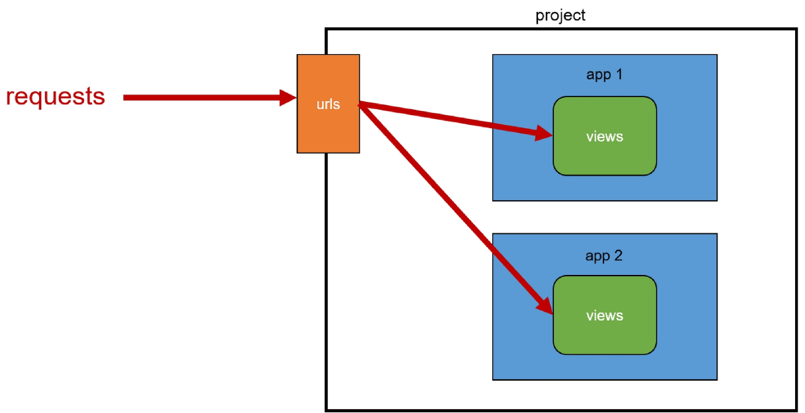
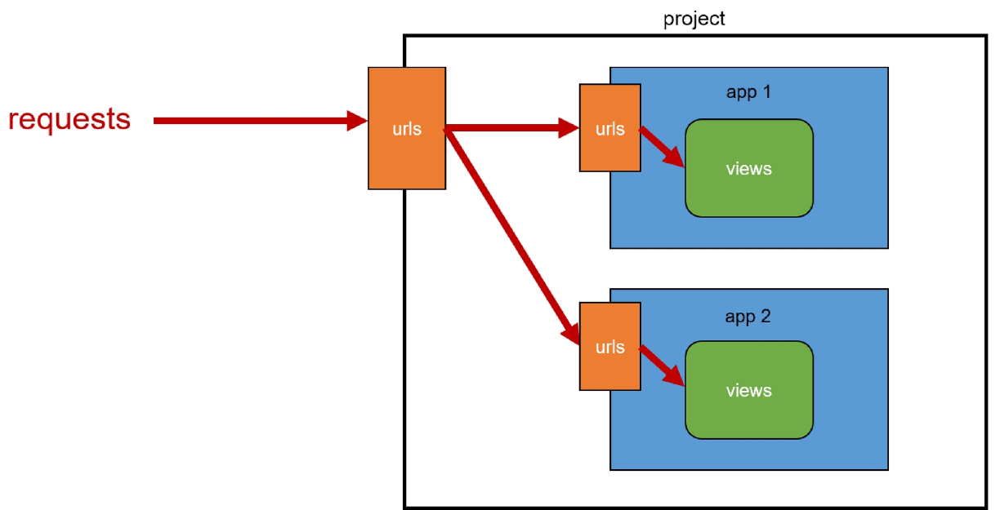
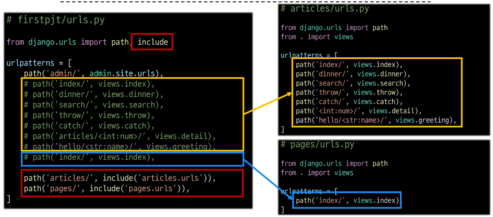
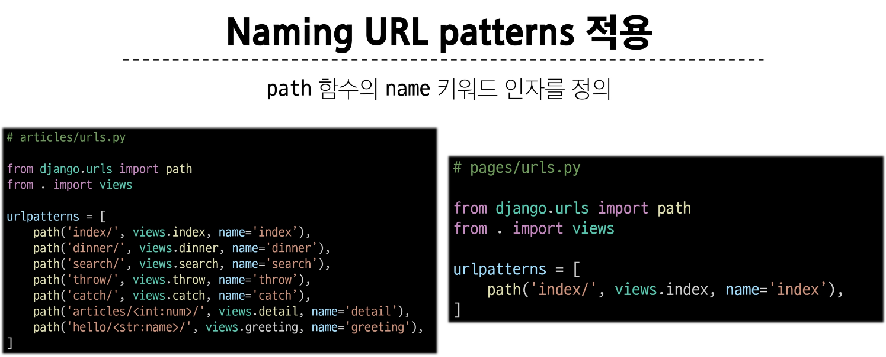
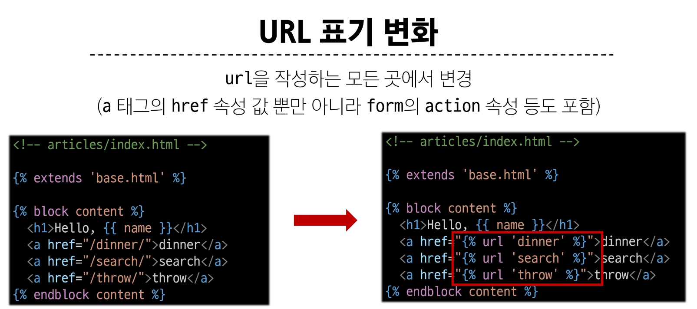
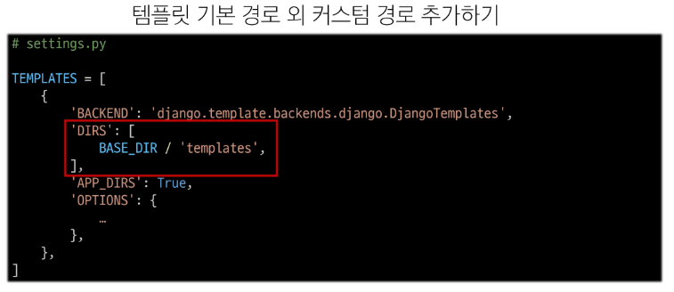
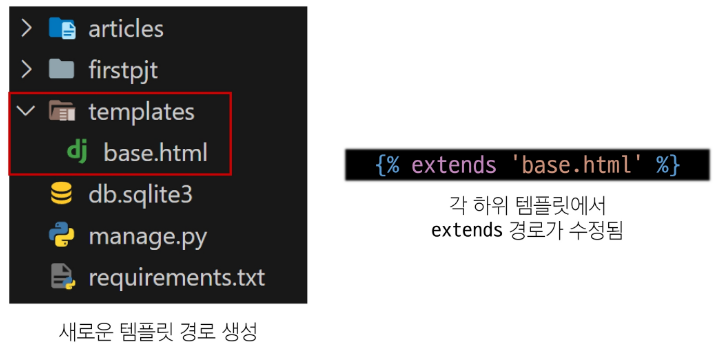
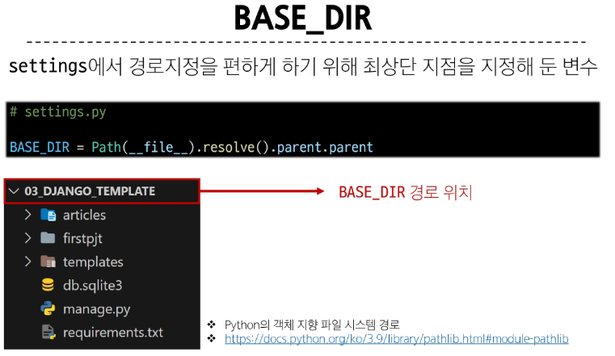

# Django

## Template System

### Django Template System

- 데이터 표현을 제어하면서, 표현과 관련된 부분을 담당

#### HTML의 콘텐츠를 변수의 값에 따라 변경하기

```html
<!-- articles/index.html -->
<body>
  <h1>Hello, {{ name }}></h1>
</body>
```

```py
#articles/views.py
def index(request):
    context = {
        'name': 'Jane',
    }
    return render(request, 'articles/index.html', context)
```

### Django Template Language(DTL)

- Template에서 조건, 반복, 변수 등의 프로그래밍적 기능을 제공하는 시스템

#### DTL Syntax

1. Variable
   - render 함수의 세번째 인자로 딕셔너리 데이터를 사용
   - 딕셔너리 key에 해당하는 문자열이 template에서 사용 가능한 변수명이 됨
   - dot('.')를 사용하여 변수 속성이 접근할 수 있음
   - `{{variable}}`, `{{variable.attribute}}`
2. Filters
   - 표시할 변수를 수정할 때 사용 (변수 + '|' + 필터)
   - chained(연결)이 가능하며 일부 필터는 인자를 받기도 함
   - 약 60개의 built-in template filters를 제공
   - `{{ variable|filter }}`, `{{ name|truncatewords:30 }}`
3. Tags
   - 반복 또는 논리를 수행하여 제어 흐름을 만듦
   - 일부 태그는 시작과 종료 태그가 필요
   - 약 24개의 built-in template tags를 제공
   - ``, ` `
4. Comments
   - DTL에서의 주석
   - ``, ``

### 템플릿 상속

- 페이지의 공통요소를 포함하고, 하위 템플릿이 재정의 할 수 있는 공간을 정의하는 기본 'skeleton' 템플릿을 작성하여 상속 구조를 구축

#### 상속 구조

```h
<!DOCTYPE html>
<html lang="en">
  <head>
    <meta charset="utf-8" />
    <meta name="viewport" content="width=device-width, initial-scale=1" />
    <title>Bootstrap demo</title>
    <link
      href="https://cdn.jsdelivr.net/npm/bootstrap@5.3.3/dist/css/bootstrap.min.css"
      rel="stylesheet"
      integrity="sha384-QWTKZyjpPEjISv5WaRU9OFeRpok6YctnYmDr5pNlyT2bRjXh0JMhjY6hW+ALEwIH"
      crossorigin="anonymous"
    />
  </head>
  <body>
     
    <script
      src="https://cdn.jsdelivr.net/npm/bootstrap@5.3.3/dist/js/bootstrap.bundle.min.js"
      integrity="sha384-YvpcrYf0tY3lHB60NNkmXc5s9fDVZLESaAA55NDzOxhy9GkcIdslK1eN7N6jIeHz"
      crossorigin="anonymous"
    ></script>
  </body>
</html>
```

```h



  <h1>Hello, {{ name }}</h1>

```

```h



  <p>{{picked}} 메뉴는 {{picked|length}} 글자 입니다.</p>
  <h2>메뉴판</h2>
  <ul>
  
  <li>{{food}}</li>
  
  </ul>
  
  <p>메뉴가 소진되었습니다.</p>
  
  <p>아직 메뉴가 남았습니다.</p>
  

```

### 상속 관련 DTL 태그

#### 'extends' tag

- ``
- 자식(하위) 템플릿이 부모 템플릿을 확장한다는 것을 알림
- 반드시 자식 템플릿 최상단에 작성되어야 함 (2개 이상 사용 불가)

#### 'block' tag

- ``
- 하위 템플릿에서 재정의 할 수 있는 블록을 정의<br>(상위 템플릿에 작성하며 하위 템플릿이 작성할 수 있는 공간을 지정하는 것)

### HTML form

#### 요청과 응답

- 데이터를 보내고 가져오기
  - HTML 'form'은 HTTP 요청을 서버에 보내는 가장 편리한 방법

#### 'form' element

- 사용자로부터 할당된 데이터를 서버로 전송
- 웹에서 사용자 정보를 입력하는 여러 방식<br>(text, password, checkbox 등)을 제공

#### 'action' & 'method' element

- form의 핵심 속성 2가지
- 데이터를 어디(action)로 어떤 방식(method)으로 요청할지
- action
  - 입력 데이터가 전송될 URL을 지정(목적자)
  - 만약 이 속성을 지정하지 않으면 데이터는 현재 form이 있는 페이지의 URL로 보내짐
- method
  - 데이터를 어떤 방식으로 보낼 것인지 정의
  - 데이터의 HTTP request methods(GET, POST)를 지정

#### 'input' element

- 사용자의 데이터를 입력받을 수 있는 요소<br>(type 속성 값에 따라 다양한 유형의 입력 데이터를 받음)
- 핵심 속성 - 'name'
  - 사용자가 입력한 데이터에 붙이는 이름(key)
  - 데이터를 제출했을 때 서버는 name 속성에 설정된 값을 통해서만 사용자가 입력한 데이터에 접근할 수 있음

#### Query String Parameters

- 사용자의 입력 데이터를 URL 주소에 파라미터를 통해 서버로 보내는 방법
- 문자열은 엠퍼샌드('&')로 연결된 key=value 쌍으로 구성되며, 기본 URL과 물음표('?')로 구분됨

### form 활용

#### HTTP request 객체

- form으로 전송한 데이터 뿐만 아니라 Django로 들어오는 모든 요청 관련 데이터가 담겨 있음(view 함수의 첫번째 인자로 전달됨)

## Django URLs

#### URL dispatcher(운항관리자, 분배기)

- URL 패턴을 정의하고 해당 패턴이 일치하는 요청을 처리할 view함수를 연결(매핑)

### Variable Routing

#### 현재 URL 관리의 문제점

- 템플릿의 많은 부분이 중복되고, URL 의 일부만 변경되는 상황이라면 계속해서 비슷한 URL과 템플릿을 작성해야하는가?

#### Variable Routing

- URL 일부에 변수를 포함시키는 것(변수는 view 함수의 인자로 전달 할 수 있음)
- 작성법
  - `<path_converter:variable_name>`
  - `path('articles/<int:num>/', views.detail)`
  - `path('hello/<str:name>/', views.greeting)`

### App과 URL

#### App URL mapping

- 각 앱에 URL을 정의하는 것
- 프로젝트와 각 앱이 URL을 나누어 관리를 편하게 하기 위함

- 기존 URL 구조
  - 
- 변경 URL 구조
  - 
- URL 구조 변화
  - 

### URL 이름 지정

#### Naming URL patterns

- URL에 이름을 지정하는 것(path 함수의 name 인자를 정의해서 사용)
  
  

#### DTL URL tag

- ``
- 주어진 URL 패턴의 이름과 일치하는 절대 경로 주소를 반환

### URL 이름 공간

#### URL 이름 지정 후 남은 문제

- articles 앱의 url 이름과 pages 앱의 url 이름이 같은 상황
- 단순히 이름만으로는 완벽하게 분리할 수 없음
- "이름에 성(key)을 붙이자"

#### app_name 속성

- URL tag의 최종 변화
  - 마지막으로 url 태그가 사용하는 모든 곳의 표기 변경하기
    - Confidential 
    -  -> 

## 참고

### 추가 템플릿 경로





### DTL 주의사항

- Python처럼 일부 프로그래밍 구조(if, for 등)를 사용할 수 있지만 명칭을 그렇게 설계 했을 뿐이지 Python 코드로 실행되는 것이 아니며 Python과는 관련 없음
- 프로그래밍적 로직이 아니라 표현을 위한 것임을 명심하기
- 프로그래밍적 로직은 되도록 view 함수에서 작성 및 처리할 것
- 공식문서를 참고해 다양한 태그와 필터 사용해보기

### Trailing Slashes

- Django는 URL 끝에 '/'가 없다면 자동으로 붙임
- "기술적인 측면에서, foo.com/bar와 foo.com/bar/는 서로 다른 URL"
  - 검색 엔진 로봇이나 웹 트래픽 분석 도구에서는 이 두 주소를 서로 다른 페이지로 보기 때문
- 그래서 Django는 검색 엔진이 혼동하지 않게 하기 위해 무조건 붙이는 것을 선택한 것
- 그러나 모든 프레임워크가 이렇게 동작하는 것은 아니니 주의
