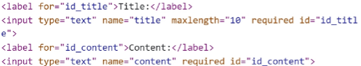
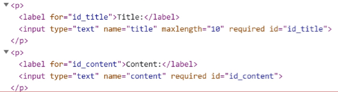

# Django

## Django Form

#### HTML 'form'

- 지금까지 사용자로부터 데이터를 제출받기 위해 활용한 방법 그러나 비정상적 혹은 악의적인 요청을 필터링 할 수 없음
- 유효한 데이터인지에 대한 확인이 필요

#### 유효성 검사

- 수집한 데이터가 정확하고 유효한지 확인하는 과정
- 유효성 검사를 구현하기 위해서는 입력 값, 형식, 중복, 범위, 보안 등 많은 것들을 고려해야 함
- 이런 과정과 기능을 직접 개발하는 것이 아닌 Django가 제공하는 Form을 사용

### Form class

#### Django Form

- 사용자 입력 데이터를 수집하고 처리 및 유효성 검사를 수행하기 위한 도구
- 유효성 검사를 단순하고 자동화 할 수 있는 기능을 제공
- Form class 정의

  ```py
  # articles/forms.py

  from django import forms

  class ArticleForm(forms.Form):
      title = forms.CharField(max_length=10)
      content = forms.CharField()
  ```

- Form class를 적용한 new

  ```py
  # articles/views.py

  from .forms import ArticleForm

  def new(request):
      form = ArticleForm()
      context = {
          'form': form,
      }
      return render(request, 'articles/new.html', context)
  ```

  ```html
  <!-- articles/new.html -->

  <h1>NEW</h1>
  <form action="" method="POST">
     {{ form }}
    <input type="submit" />
  </form>
  ```

  

- Form rendering options

  - label, input 쌍을 특정 HTML 태그로 감싸는 옵션

    ```html
    <!-- articles/new.html -->

    <h1>NEW</h1>
    <form action="" method="POST">
       {{ form.as_p }}
      <input type="submit" />
    </form>
    ```

    

### Widgets

## Django ModelForm

### Meta class

### ModelForm 적용

## HTTP 요청 다루기

### View 함수 구조 변화

### new & create 함수 구조 변화

### edit & update 함수 결합

## 참고

### ModelForm의 키워드 인자 구성

### Widgets 응용

### 필드를 수동으로 렌더링
