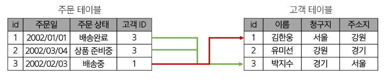

# DB_SQL

## Database

- 체계적인 데이터 모음
  - 데이터를 저장하고 조작(CRUD)
- 기존 데이터 저장 방식
  1. 파일 이용
     - 어디서나 쉽게 사용가능
     - 데이터를 구조적으로 관리 힘듬
  2. 스프레드 시트 이용
     - 테이블의 열과 행을 사용해 데이터를 구조적으로 관리 가능
     - 한계
       - 일반적으로 100만행까지만 저장 가능
       - 단순히 파일이나 링크 소유 여부에 따른 단순한 접근 권한 기능 제공
       - 데이터의 변경이 발생시 테이블의 모든 위치에서 해당 값을 업데이트 해야함. 찾기 및 바꾸기로 할 수는 있지만 여러 시트에 분산되어 있다면 누락 발생하거나 추가 문제 발생할 수 있음

## Relational Database

#### 데이터베이스 역학

- 데이터를 저장(구조적 저장)하고 조작(CRUD)

#### 관계형 데이터베이스

- 데이터 간에 관계가 있는 데이터 항목들의 모음
- 테이블, 행, 열의 정보를 구조화하는 방식
- 서로 관련된 데이터 포인터를 저장하고 이에 대한 액세스를 제공
  

#### 관계

- 여러 테이블 간의 (논리적) 연결
- 이 관계로 인해 두 테이블을 사용하여 데이터를 다양한 형식으로 조회할 수 있음
  - 특정 날짜에 구매한 모든 고객 조회
  - 지난 달에 배송일이 지연된 고객 조회 등

#### 관계형 데이터베이스 예시

- 다음과 같이 고객 데이터가 테이블에 저장되어 있다고 가정

  고객테이블

  |  이름  | 청구지 | 주소지 |
  | :----: | :----: | :----: |
  | 김한웅 |  서울  |  강원  |
  | 유미선 |  강원  |  경기  |
  | 박지수 |  경기  |  서울  |

- 고객 데이터 간 비교를 위해 어떤 값 활용?
  - 이름? 주소? 만약 동명이인이나 같은 주소지가 존재한다면?
- 각 데이터에 고유한 식별값 부여하기 (기본 키, Primary Key)

  고객테이블

  | id  |  이름  | 청구지 | 주소지 |
  | :-: | :----: | :----: | :----: |
  |  1  | 김한웅 |  서울  |  강원  |
  |  2  | 유미선 |  강원  |  경기  |
  |  3  | 박지수 |  경기  |  서울  |

  ex> 주민등록번호

- 다음과 같이 각 고객이 주문한 주문 데이터가 테이블에 저장되어 있다고 가정

  주문테이블

  | id  |   주문일   |  주문 상태  |
  | :-: | :--------: | :---------: |
  |  1  | 2002/01/01 |  배송완료   |
  |  2  | 2002/03/04 | 상품 준비중 |
  |  3  | 2002/02/03 |   배송중    |

  고객테이블

  | id  |  이름  | 청구지 | 주소지 |
  | :-: | :----: | :----: | :----: |
  |  1  | 김한웅 |  서울  |  강원  |
  |  2  | 유미선 |  강원  |  경기  |
  |  3  | 박지수 |  경기  |  서울  |

- 누가 어떤 주문을 했는지 어떻게 식별?
  - 고객이름? 동명이인 존재한다면?
- 주문 정보에 고객의 고유한 식별값 저장(외래 키, Foreign Key)

  주문테이블

  | id  |   주문일   |  주문 상태  | 고객 ID |
  | :-: | :--------: | :---------: | :-----: |
  |  1  | 2002/01/01 |  배송완료   |    3    |
  |  2  | 2002/03/04 | 상품 준비중 |    2    |
  |  3  | 2002/02/03 |   배송중    |    1    |

  고객테이블

  | id  |  이름  | 청구지 | 주소지 |
  | :-: | :----: | :----: | :----: |
  |  1  | 김한웅 |  서울  |  강원  |
  |  2  | 유미선 |  강원  |  경기  |
  |  3  | 박지수 |  경기  |  서울  |

#### 관련 키워드

1. Table (_aka_ Relation)
   - 데이터를 기록하는 곳
2. Field (_aka_ Column, Attribute)\
   - 각 필드에는 고유한 데이터 형식(타입)이 지정됨
3. Record (_aka_ Row, Tuple)
   - 각 레코드에는 구체적인 데이터 값이 저장됨
4. Database (_aka_ Schema)
   - 테이블의 집합
5. Primary Key (기본 키, PK)
   - 각 레코드의 고유한 값
   - 관계형 데이터베이스에서 레코드의 식별자로 활용
6. Foreign Key (외래 키, FK)
   - 테이블의 필드 중 다른 테이블의 레코드를 식별할 수 있는 키
   - 다른 테이블의 기본 키를 참조
   - 각 레코드에서 서로 다른 테이블 간의 관계를 만드는 데 사용

#### 정리

- Table은 데이터가 기록되는 곳
- Table에는 행에서 고유하게 식별 가능한 기본 키라는 속성이 있으며, 외래 키를 사용하여 각 행에서 서로 다른 테이블 간의 관계를 만들 수 있음
- 데이터는 기본 키 또는 외래 키를 통해 결합(join)될 수 있는 여러 테이블에 걸쳐 구조화 됨

### RDBMS

#### DBMS(Database Management System)

- 데이터베이스를 관리하는 소프트웨어 프로그램
- 데이터 저장 및 관리를 용이하게 하는 시스템
- 사용자가 데이터 구성, 업데이트, 모니터링, 백업, 복구 등을 할 수 있도록 도움

#### RDBMS(Relational Database Management System)

- 관계형 데이터베이스를 관리하는 소프트웨어 프로그램
- 서비스 종류
  - SQLite
    - 경량의 오픈 소스 데이터베이스 관리 시스템
    - 컴퓨터나 모바일 기기에 내장되어 간단하고 효율적인 데이터 저장 및 관리를 제공
  - MySQL
  - PostgreSQL
  - Oracle Databse
  - ...

## SQL (Structure Query Language)

- 테이블의 형태로 구조화된 관계형 데이터베이스에게 요청을 질의(요청)
- 데이터베이스에 정보를 저장하고 처리하기 위한 프로그래밍 언어

### SQL Syntax

```sql
SELECT column_name FROM table_name;
```

1. SQL 키워드는 대소문자를 구분하지 않음
   - 하지만 대문자로 작성하는 것을 권장(명시적 구분)
2. 각 SQL Statements의 끝에는 세미콜론(';')이 필요
   - 세미콜론은 각 SQL Statements을 구분하는 방법(명령의 마침표)

### SQL Statements

- SQL을 구성하는 가장 기본적인 코드 블록

```sql
SELECT column_name FROM table_name;
```

- 이 Statement는 **SELECT**, **FROM** 2개의 키워드로 구성됨

#### 유형

1. DDL - 데이터 정의
   - 역할 ; 데이터의 기본 구조 및 형식 변경
   - SQL 키워드 ; CREATE, DROP, ALTER
2. DQL - 데이터 검색
   - 역할 ; 데이터 검색
   - SQL 키워드 ; SELECT
3. DML - 데이터 조작
   - 역할 ; 데이터 조작(추가, 수정, 삭제)
   - SQL 키워드 ; INSERT, UPDATE, DELETE
4. DCL - 데이터 제어
   - 역할 ; 데이터 및 작업에 대한 사용자 권한 제어
   - SQL 키워드 ; COMMIT, ROLLBACK, GRANT, REVOKE

### 참고

#### Query

- 데이터베이스로부터 정보를 요청하는 것
- 일반적으로 SQL로 작성하는 코드를 쿼리문(SQL문)이라 함

#### SQL 표준

- SQL은 미국 국립 표준 협회(ANSI)와 국제 표준화 기구(ISO)에 의해 표준이 채택됨
- 모든 RDBMS에서 SQL 표준을 지원
- 다만 각 RDBMS마다 독자적인 기능에 따라 표준을 벗어나는 문법이 존재하니 주의

## Single Table Queries

### Querying data

#### SELECT

- SELECT statement ; 테이블에서 데이터를 조회

#### SELECT syntax

```sql
SELECT select_list
FROM table_name;
```

- SELECT 키워드 이후 데이터를 선택하려는 필드를 하나 이상 지정
- FROM 키워드 이후 데이터를 선택하려는 테이블의 이름을 지정

#### SELECT 활용

- 테이블 employees에서 LastName 필드의 모든 데이터를 조회

  ```sql
  SELECT LastName
  FROM employees;
  ```

- 테이블 employees에서 LastName, FirstName 필드의 모든 데이터를 조회

  ```sql
  SELECT LastName, FirstName
  FROM employees;
  ```

- 테이블 employees에서 모든 필드 데이터를 조회

  ```sql
  SELECT *
  FROM employees;
  ```

- 테이블 employees에서 FirstName 필드의 모든 데이터를 조회

  - 단, 조회시 FirstName이 아닌 '이름'으로 출력

  ```sql
  SELECT FirstName AS '이름'
  FROM employees;
  ```

- 테이블 track에서 Name, Milliseconds 필드의 모든 데이터를 조회

  - 단, 조회시 Milliseconds 필드는 60000으로 나눠 분 단위 값으로 출력

  ```sql
  SELECT Name, Milliseconds / 60000 AS '재생 시간(분)'
  FROM tracks;
  ```

#### SELECT 정리

- 테이블의 데이터를 조회 및 반환
- '\*' (asterisk)를 사용하여 모든 필드 선택

### Sorting data

#### ORDER BY statement

- 조회 결과의 레코드를 정렬

#### ORDER BY syntax

```sql
SELECT select_list
FROM table_name
ORDER BY
    column1 [ASC|DESC],
    column2 [ASC|DESC],
    ...;
```

- FROM clause 뒤에 위치
- 하나 이상의 컬럼을 기준으로 결과를 오름차순(ASC, 기본 값), 내림차순(DESC)으로 정렬

#### ORDER BY 활용

- 테이블 employees에서 FirstName 필드의 모든 데이터를 오름차순으로 조회

  ```sql
  SELECT FirstName
  FROM employees
  ORDER BY FirstName;
  ```

- 테이블 employees에서 FirstName 필드의 모든 데이터를 내림차순으로 조회

  ```sql
  SELECT FirstName
  FROM employees
  ORDER BY FirstName DESC;
  ```

- 테이블 customers에서 Country 필드를 기준으로 내림차순 정렬한 다음 City 필드 기준으로 오름차순 정렬하여 조회

  ```sql
  SELECT Country, City
  FROM customers
  ORDER BY Country DESC, City;
  ```

- 테이블 tracks에서 Milliseconds 필드를 기준으로 내림차순 정렬한 다음 Name, Milliseconds 필드의 모든 데이터를 조회

  ```sql
  SELECT Name, Milliseconds / 60000 AS '재생 시간(분)'
  FROM tracks
  ORDER BY Milliseconds DESC;
  ```

#### 정렬에서의 NULL

NULL 값이 존재할 경우 오름차순 정렬 시 결과에 NULL이 먼저 출력

### Filtering data

#### 관련 키워드

- Clause
  - DISTINCT
  - WHERE
  - LIMIT
- Operator
  - BETWEEN
  - IN
  - LIKE
  - Comparison
  - Logical

#### DISTINCT statement

- 조회 결과에서 중복된 레코드를 제거

#### DISTINCT syntax

```sql
SELECT DISTINCT select_list
FROM table_name;
```

- SELECT 키워드 바로 뒤에 작성
- SELECT DISTINCT 키워드 다음에 고유한 값을 선택하려는 하나 이상의 필드를 지정

#### DISTINCT 활용

- 테이블 customers에서 Country 필드의 모든 데이터를 오름차순 조회

  ```sql
  SELECT Country
  FROM customers
  ORDER BY Country;
  ```

- 테이블 customers에서 Country 필드의 모든 데이터를 중복없이 오름차순 조회

  ```sql
  SELECT DISTINCT Country
  FROM customers
  ORDER BY Country;
  ```

#### WHERE statement

- 조회 시 특정 검색 조건을 지정

#### WHERE syntax

```SQL
SELECT select_list
FROM table_name
WHERE search_condition;
```

- FROM clause 뒤에 위치
- search_condition은 비교연산자 및 논리연산자(AND, OR, NOT등)를 사용하는 구문이 사용됨

#### WHERE 활용

- 테이블 customers에서 City 필드 값이 'Prague'인 데이터의 LastName, FirstName, City 조회

  ```sql
  SELECT LastName, FirstName, City
  FROM customers
  WHERE City = 'Prague';
  ```

- 테이블 customers에서 City 필드 값이 'Prague'가 아닌 데이터의 LastName, FirstName, City 조회

  ```sql
  SELECT LastName, FirstName, City
  FROM customers
  WHERE City != 'Prague';
  ```

- 테이블 customers에서 Company 필드 값이 NULL이고 Country 필드 값이 'USA'인 데이터의 LastName, FirstName, Company, Country 조회

  ```sql
  SELECT LastName, FirstName, Company, Country
  FROM customers
  WHERE
      Company IS NULL
      AND Country = 'USA';
  ```

- 테이블 customers에서 Company 필드 값이 NULL이거나 Country 필드 값이 'USA'인 데이터의 LastName, FirstName, Company, Country 조회

  ```sql
  SELECT LastName, FirstName, Company, Country
  FROM customers
  WHERE
      Company IS NULL
      OR Country = 'USA';
  ```

- 테이블 tracks에서 Bytes 필드 값이 10,000 이상 500,000 이하인 데이터의 Name, Bytes 조회

  ```sql
  SELECT Name, Bytes
  FROM tracks
  WHERE Bytes BETWEEN 10000 AND 500000;
  -- WHERE
  --     Bytes >= 10000
  --     AND Bytes <= 500000;
  ```

- 테이블 tracks에서 Bytes 필드 값이 10,000 이상 500,000 이하인 데이터의 Name, Bytes를 Bytes 기준으로 오름차순 조회

  ```sql
  SELECT Name, Bytes
  FROM tracks
  WHERE Bytes BETWEEN 10000 AND 500000
  ORDER BY Bytes;
  ```

- 테이블 customers에서 Country 필드 값이 'Canada' 또는 'Germany' 또는 'France'인 데이터의 LastName, FirstName, Country 조회

  ```sql
  SELECT LastName, FirstName, Country
  FROM customers
  WHERE Country IN ('Canada', 'Germany', 'France');
  -- WHERE
  --     Company = 'Canada'
  --     OR Company = 'Germany'
  --     OR Country = 'France';
  ```

- 테이블 customers에서 Country 필드 값이 'Canada' 또는 'Germany' 또는 'France'가 아닌 데이터의 LastName, FirstName, Country 조회

  ```sql
  SELECT LastName, FirstName, Country
  FROM customers
  WHERE Country NOT IN ('Canada', 'Germany', 'France');
  ```

- 테이블 customers에서 LastName 필드 값이 'son'으로 끝나는 데이터의 LastName, FirstName 조회

  ```sql
  SELECT LastName, FirstName
  FROM customers
  WHERE LastName LIKE '%son';
  ```

- 테이블 customers에서 FirstName 필드 값이 4자리면서 'a'로 끝나는 데이터의 LastName, FirstName 조회

  ```sql
  SELECT LastName, FirstName
  FROM customers
  WHERE FirstName LIKE '___a';
  ```

#### Operators

- Comparison Operators (비교 연산자)
  - `=, >=, <=, !=, IS, LIKE, IN, BETWEEN...AND`
- Logical Operators (논리 연산자)
  - `AND(&&), OR(||), NOT(!)`
- `IN` Operator
  - 값이 특정 목록 안에 있는지 확인
- `LIKE` Operator
  - 값이 특정 패턴에 일치하는지 확인
  - Wildcards와 함께 사용
- Wildcard Characters
  - `%` ; 0개 이상의 문자열과 일치하는지 확인
  - `_` ; 단일 문자와 일치하는지 확인

#### LIMIT clause

- 조회하는 레코드 수를 제한

#### LIMIT syntax

```sql
SELECT select_list
FROM table_name
LIMIT [offset,] row_count;
```

- 하나 또는 두 개 이상의 인자를 사용 (0 또는 양의 정수)
- row_count는 조회하는 최대 레코드 수를 지정

#### LIMIT 활용

- 테이블 tracks에서 TrackID, Name, Bytes 필드 데이터를 Bytes 기준 내림차순으로 7개만 조회

```sql
SELECT TrackID, Name, Bytes
FROM tracks
ORDER BY Bytes DESC
LIMIT 7;
```

- 테이블 tracks에서 TrackID, Name, Bytes 필드 데이터를 Bytes 기준 내림차순으로 4번째부터 7번째 데이터만 조회

```sql
SELECT TrackID, Name, Bytes
FROM tracks
ORDER BY Bytes DESC
LIMIT 3, 4;
-- LIMIT 4 OFFSET 3;
```

### Grouping data

#### GROUP BY clause

- 레코드를 그룹화하여 요약본 생성('집계 함수'와 함께 사용)

#### Aggregation Functions (집계 함수)

- 값에 대한 계산을 수행하고 단일한 값을 반환하는 함수
- SUM, AVG, MAX, MIN, COUNT

#### GROUP BY syntax

```sql
SELECT c1, c2, ..., cn, aggregate_function(ci)
FROM table_name
GROUP BY c1, c2, ..., cn;
```

- FROM 및 WHERE 절 뒤에 배치
- GROUP BY 절 뒤에 그룹화 할 필드 목록을 작성

#### GROUP BY 예시

1. Country 필드를 그룹화

```sql
SELECT Country
FROM customers
GROUP BY Country;
```

2. COUNT 함수가 각 그룹에 대한 집계된 값을 계산

```sql
SELECT Country, COUNT(*)
FROM customers
GROUP BY Country;
```

#### GROUP BY 활용

- 테이블 tracks에서 Composer 필드를 그룹화하여 각 그룹에 대한 Bytes의 평균 값을 내림차순 조회

  ```sql
  SELECT Composer, AVG(Bytes) AS avgOfBytes
  FROM tracks
  GROUP BY Composer
  ORDER BY avgOfBytes DESC;
  ```

- 테이블 tracks에서 Composer 필드를 그룹화하여 각 그룹에 대한 Milliseconds의 평균 값이 10 미만인 데이터 조회

  - 단, Milliseconds 필드는 60,000으로 나눠 분 단위의 값의 평균으로 계산

  ```sql
  SELECT Composer, AVG(Milliseconds / 60000) AS avgOfMinute
  FROM tracks
  WHERE avgOfMinute < 10
  GROUP BY Composer;
  ```

  - 에러 발생
  - HAVING clause
    - 집계 항목에 대한 세부 조건을 지정
    - 주로 GROUP BY와 함께 사용되며, GROUP BY가 없다면 WHERE처럼 동작

```sql
SELECT Composer, AVG(Milliseconds / 60000) AS avgOfMinute
FROM tracks
GROUP BY Composer
HAVING avgOfMinute < 10;
```

### SELECT statement 실행 순서

1. 테이블에서 (FROM)
2. 특정 조건에 맞추어 (WHERE)
3. 그룹화 하고 (GROUP BY)
4. 만약 그룹 중에서 조건이 있다면 맞추고 (HAVING)
5. 조회하여 (SELECT)
6. 정렬하고 (ORDER BY)
7. 특정 위치의 값을 가져옴 (LIMIT)

<br><br>

---

오프라인

# Managing Tables

## Create a table

### CREATE TABLE

#### CREATE TABLE statement

- 테이블 생성

#### CREATE TABLE syntax

```
CREATE TABLE table_name (
    column_1 data_type constraints,
    column_2 data_type constraints,
    ...,
);
```

- 각 필드에 적용할 데이터 타입 작성
- 테이블 및 필드에 대한 제약조건(constraints) 작성

## Modifying table fields

## Delete a table

# Modifying Data

## Insert data

## Update data

## Delete data

# Multi table queries

## Join

## Joining tables
