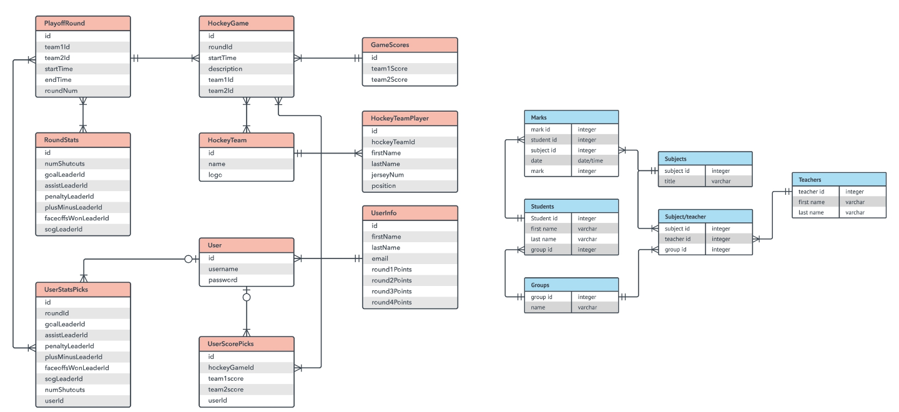
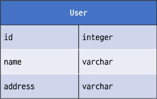
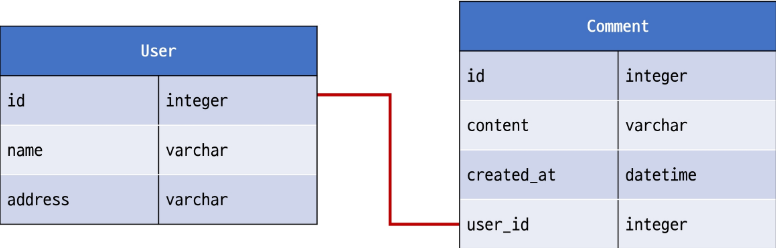
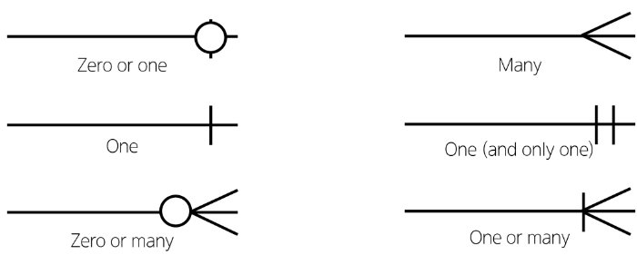
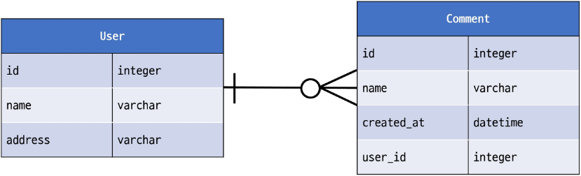

# DB

## Many to one relationships 02


#### User와 다른 모델 간의 모델 관계 설정

1. User & Article 
   - Article(N) - User(1) ; 0개 이상의 게시글은 1명의 회원에 의해 작성 될 수 있다.
2. User & Comment
   - Comment(N) - User(1) ; 0개 이상의 댓글은 1명의 회원에 의해 작성 될 수 있다.


## Article & User

### 모델 관계 설정


#### Article - User 모델 관계 설정

- User 외래 키 정의

    ```python
    # articles/models.py
    
    from django.conf import settings
    
    class Article(models.Model):
        user = models.ForeignKey(settings.AUTH_USER_MODEL, on_delete=models.CASCADE)
        title = models.CharField(max_length=10)
        content = models.TextField()
        created_at = models.DateTimeField(auto_now_add=True)
        updated_at = models.DateTimeField(auto_now=True)
    ```
    
    
    
    #### User 모델을 참조하는 2가지 방법
    
    - django 프로젝트 '내부적인 구동 순서'와 '반환 값'에 따른 이유
    - 기억해야 할 것은 User 모델은 직접 참조하지 않는다는 것

|           |          get_user_model()           |  settings.AUTH_USER_MODEL   |
| :-------: | :---------------------------------: | :-------------------------: |
|  반환 값  |        User Object<br>(객체)        | 'accounts.User'<br>(문자열) |
| 사용 위치 | models.py가 아닌 <br>다른 모든 위치 |          models.py          |


#### Migration

- 기존 테이블이 있는 상황에서 필드를 추가하려 하기 때문에 발생하는 과정
- 기본적으로 모든 필드에는 NOT NULL 제약조건이 있기 때문에 데이터 없이는 새로운 필드가 추가되지 못함
- '1'을 입력하고 Enter 진행 (다음 화면에서 직접 기본 값 입력)
  - 추가하는 외래 키 필드에 어떤 데이터를 넣을 것인지 직접 입력해야 함
- 마찬가지로 '1'을 입력하고 Enter 진행
  - 기존에 작성된 게시글이 있다면 모두 1번 회원이 작성한 것으로 처리됨
- migrations 파일 생성 후 migrate 진행
- articles_article 테이블에 user_id 필드 생성 확인

### 게시글 CREATE

1. 기존 ArticleForm 출력 변화 확인

   - User 모델에 대한 외래 키 데이터 입력을 위해 불필요한 input이 출력됨

   

2. ArticleForm 출력 필드 수정

   ```py
   # articles/forms.py
   
   class ArticleForm(forms.ModelForm):
       class Meta:
           model = Article
           fields = ('title', 'content',)
   ```

    

3. 게시글 작성 시 에러 발생

   - user_id 필드 데이터가 누락되었기 때문

   

4. 게시글 작성 시 작성자 정보가 함께 저장될 수 있도록 save의 commit 옵션 활용

   ```py
   # articles/views.py
   
   @login_required
   def create(request):
       if request.method == 'POST':
           form = ArticleForm(request.POST)
           if form.is_valid():
               article = form.save(commit=False)
               article.user = request.user
               article.save()
               return redirect('articles:detail', article.pk)
       else:
           ...
   ```

    

5. 게시글 작성 후 테이블 확인

### 게시글 READ

#### 각 게시글 작성자 이름 출력

```html
<!-- articles/index.html -->


  <p>작성자 : {{ article.user }}</p>
  <p>글 번호 : {{ article.pk }}</p>
  <a href="">
      <p>글 제목 : {{ article.title }}</p>
  </a>
  <p>글 내용 : {{ article.content }}</p>
  <hr>

```


```html
<!-- articles/detail.html -->

<h2>DETAIL</h2>
<h3>{{ article.pk }} 번째 글</h3>
<hr>
<p>작성자 : {{ article.user }}</p>
<p>제목 : {{ article.title }}</p>
<p>내용 : {{ article.content }}</p>
<p>작성 시각 : {{ article.created_at }}</p>
<p>수정 시각 : {{ article.updated_at }}</p>
```


### 게시글 UPDATE

- 게시글 수정 요청 사용자와 게시글 작성 사용자를 비교하여 본인의 게시글만 수정 할 수 있도록 하기

  ```python
  # articles/views.py
  
  @login_required
  def update(request, pk):
      article = Article.objects.get(pk=pk)
      if request.user == article.user:
          if request.method == 'POST':
              form = ArticleForm(request.POST,instance=article)
              if form.is_vaild():
                  form.save()
                  return redirect('articles:detail', article.pk)
          else: form = ArticleForm(instance=article)
      else: return redirect('articles:index')
  ```

  

- 해당 게시글의 작성자가 아니라면, 수정/삭제 버튼을 출력하지 않도록 하기

  ```html
  <!-- articles/detail.html -->
  
  
    <a href="">UPDATE</a><br>
    <form action="" method="POST">
      
      <input type="submit" value="DELETE">
    </form>
  
  ```

### 게시글 DELETE

- 삭제를 요청하려는 사람과 게시글을 작성한 사람을 비교하여 본인의 게시글만 삭제할 수 있도록 하기

  ```py
  # articles/views.py
  
  @login_required
  def delete(request, pk):
      article = Article.objects.get(pk=pk)
      if request.user == article.user:
          article.delete()
      return redirect('articles:index')
  ```

  

## Commet & USer

### 모델 관계 설정


#### 1. Comment - User 모델 관계 설정

- User 외래 키 정의

  ```py
  # articles/models.py
  
  class Comment(models.Model):
      article = models.ForeignKey(Article, on_delete=models.CASCADE)
      user = models.ForeignKey(settings.AUTH_USER_MODEL, on_delete=models.CASCADE)
      content = models.CharField(max_length=200)
      created_at = models.DateTimeField(auto_now_add=True)
      updated_at = models.DateTimeField(auto_now=True)
  ```

  

#### 2. Migration

- 이전에 Article과 User 모델 관계 설정 때와 동일한 상황

- 기존 Comment 테이블에 새로운 필드가 빈 값으로 추가 될 수 없기 때문에 기본 값 설정 과정이 필요

  ```bash
  $ python manage.py makemigrations
  
  #... 공통 과정 생략
  
  $ python manage.py migrate
  ```

- Migration 후 articles_comment 테이블에 user_id 필드 확인

### 댓글 CREATE

- 댓글 작성 시 이전에 게시글 작성할 때와 동일한 에러 발생

- 댓글의 user_id 필드 데이터가 누락되었기 때문

- 댓글 작성 시 작성자 정보가 함께 저장할 수 있도록 작성

  ```python
  # articles/views.py
  
  def comments_create(request, pk):
      article = Article.objects.get(pk=pk)
      comment_form = CommentForm(request.POST)
      if comment_form.is_valid():
          comment = comment_form.save(commit=False)
          comment.article = article
          comment.user = request.user
          comment.save()
          return redirect('articles:detail'. article.pk)
      ...
  ```

- 댓글 작성 후 테이블 확인

### 댓글 READ

- 댓글 출력 시 댓글 작성자와 함께 출력

  ```html
  <!-- articles/detail.html -->
  
  
    <li>
      {{ comment.user }} - {{ comment.content }}
      ...
    </li>
  
  ```

  

### 댓글 DELETE

- 댓글 삭제 요청 사용자와 댓글 작성 사용자를 비교하여 본인의 댓글만 삭제 할 수 있도록 하기

  ```py
  # articles/views.py
  
  def comments_delete(request, article_pk, comment_pk):
      comment = Comment.objects.get(pk=comment_pk)
      if request.user == comment.user:
          commentdelete()
      return redirect('articles:detail', article_pk)
  ```

  

- 해당 댓글의 작성자가 아니라면, 댓글 삭제 버튼을 출력하지 않도록 함

  ```html
  <!-- articles/detail.html -->
  
  <ul>
    
      <li>
        {{ comment.user }} - {{ comment.content }}
        
          <form action="" method="POST">
            
            <input type="submit" value="DELETE">
          </form>
      
      </li>
    
  </ul>
  ```

  

## View decorators

- View 함수의 동작을 수정하거나 추가 기능을 제공하는 데 사용되는 Python 데코레이터
- 코드의 재사용성을 높이고 뷰 로직을 간결하게 유지


#### View decorators 종류

- Allowed HTTP methods
- Conditional view processing
- GZip compression
- ...

### Allowed HTTP methods

- 특정 HTTP method로만 View 함수에 접근할 수 있도록 제한하는 데코레이터


#### 주요 Allowed HTTP methods

1. require_http_methods(["METHOD1", "METHOD2", ...])

   - 지정된 HTTP method만 허용

     ```python
     from django.views.decorators.http import require_http_methods
     
     @require_http_methods(['GET', 'POST'])
     def func(request):
         pass
     ```

     

2. require_safe()

   - GET과 HEAD method만 허용

     ```python
     from django.views.decorators.http import require_safe
     
     @require_safe
     def func(request):
         pass
     ```

     

3. require_POST()

   - POST method만 허용

     ```py
     from django.views.decorators.http import require_POST
     
     @require_POST
     def func(request):
         pass
     ```


#### Allowed HTTP methods 주요 특징

- 지정되지 않은 HTTP methods로 요청이 들어오면 HttpResponseNotAllowed (405)를 반환
- 대문자로 HTTP method를 지정


#### require_GET 대신 require_safe를 권장하는 주요 이유

- 웹 표준 준수
  - GET과 HEAD는 "안전한(safe)" 메소드로 간주됨
- 호환성
  - 일부 소프트웨어는 HEAD 요청에 의존
- -> 웹 표준을 준수하고, 더 넓은 범위의 클라이언트와 호환되며, 안전한 HTTP 메소드만을 허용하는 view 함수를 구현할 수 있음


## ERD

#### 개요

- "Entity-Relationship Diagram"

- 데이터베이스의 구조를 시각적으로 표현하는 도구

- Entity(개체), 속성, 그리고 엔티티 간의 관계를 그래픽 형태로 나타내어 시스템의 논리적 구조를 모델링하는 다이어그램

  

### ERD 구성 요소

1. 엔티티(Entity)
   - 데이터베이스에 저장되는 객체나 개념
   - ex) 고객, 주문, 제품
2. 속성(Attribute)
   - 엔티티의 특성이나 성질
   - ex) 고객(이름, 주소, 전화번호)
3. 관계(Relationship)
   - 엔티티 간의 연관성
   - ex) 고객이 '주문'한 제품


#### 개체와 속성

- 개체 : 회원(User)

- 속성 : 회원번호(id), 이름(name), 주소(address) 등

  - 개체가 지닌 속성 및 속성의 데이터 타입

  

#### 관계

- 관계 : 회원과 댓글 간의 관계
  - 회원이 "작성" 한 댓글



#### Cardinality

- 한 엔티티와 다른 엔티티 간의 수적 관계를 나타내는 표현
- 주요 유형
  1. 일대일 (one-to-one, 1:1)
  2. 다대일 (many-to-one, N:1)
  3. 다대다 (many-to-many, M:N)


#### Cardinality 표현

- 선의 끝부분에 표시되며 일반적으로 숫자나 기호(까마귀 발)로 표현됨



#### Cardinality 적용

- 회원은 여러 댓글을 작성한다.
- 각 댓글은 하나의 회원만 존재한다.




#### ERD의 중요성

- 데이터베이스 설계의 핵심 도구
- 시각적 모델링으로 효과적인 의사소통 지원
- 실제 시스템 개발 전 데이터 구조 최적화에 중요

### ERD 제작 사이트

- ##### [Draw.io](https://app.diagrams.net/)

  - 별도의 회원가입 없이 바로 사용 가능
  - 다양한 다이어그램 템플릿 제공

- ##### [ERDCloud](https://www.erdcloud.com/)

  - 실시간 협업 기능 지원


## 참고

### 추가 기능 구현

#### 인증된 사용자만 댓글 작성 및 삭제

```py
# articles/views.py

@login_required
def comments_create(request, pk):
    pass

@login_required
def comments_delete(request, article_pk, comment_pk):
    pass
```

