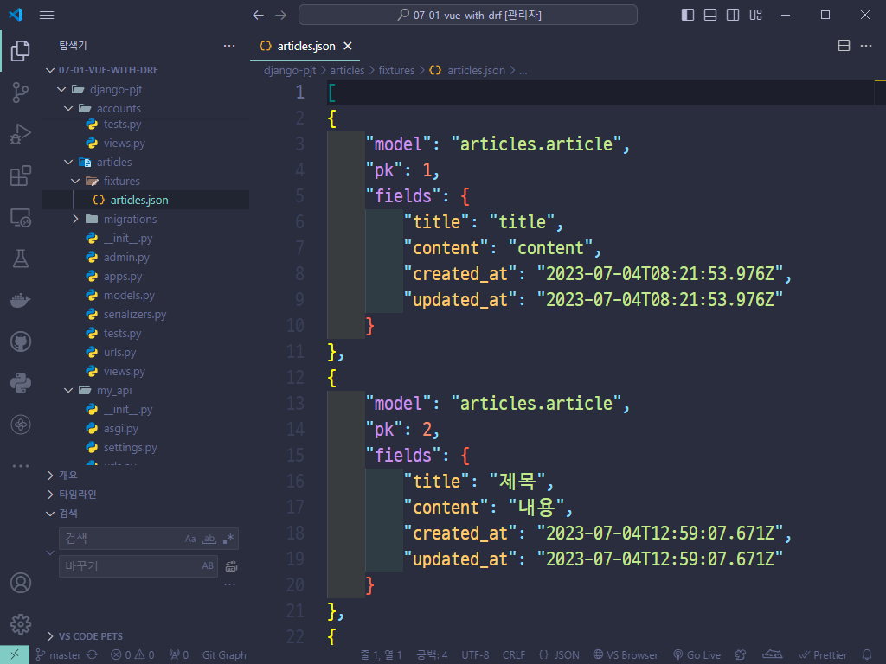
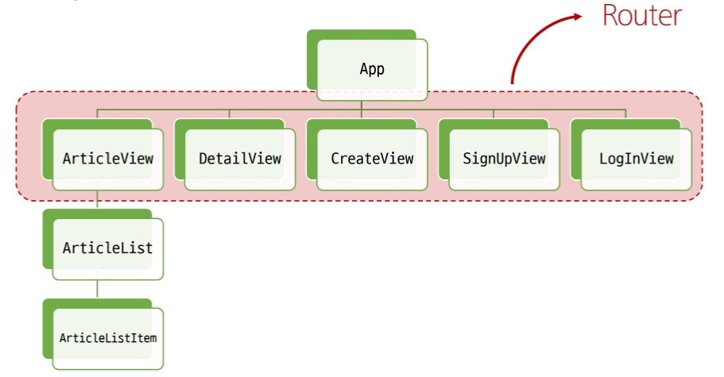
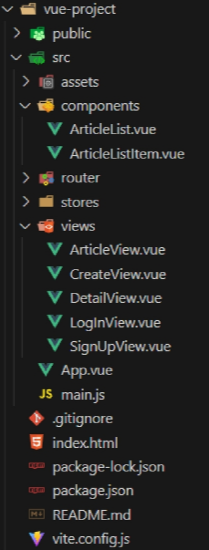

# Vue

## Vue with DRF 01


## 프로젝트 개요

### DRF 프로젝트 안내

- 스켈레톤 프로젝트 **`django-pjt`** 제공
- 외부 패키지 및 라이브러리는 **`requirements.txt`**에 작성되어 있음

➤ DRF 프로젝트는 "주석을 해제"하며 진행


#### Skeleton Code 살펴보기

- **`Model`** 클래스 확인

```py
# articles/models.py

from django.db import models
from django.conf import settings

class Article(models.Model):
    # user = models.ForeignKey(
    #     settings.AUTH_USER_MODEL, on_delete=models.CASCADE
    # )
    title = models.CharField(max_length=100)
    content = models.TextField()
    created_at = models.DateTimeField(auto_now_add=True)
    updated_at = models.DateTimeField(auto_now=True)
```

```py
# accounts/models.py

from django.db import models
from django.contrib.auth.models import AbstractUser

# Create your models here.
class User(AbstractUser):
    pass
```


- **`URL`** 확인

```py
# my_api/urls.py

from django.contrib import admin
from django.urls import path, include

urlpatterns = [
    path('admin/', admin.site.urls),
    path('api/v1/', include('articles.urls')),
    # path('accounts/', include('dj_rest_auth.urls')),
    # path('accounts/signup/', include('dj_rest_auth.registration.urls')),
]
```

```py
# articles/urls.py

from django.urls import path
from . import views


urlpatterns = [
    path('articles/', views.article_list),
    path('articles/<int:article_pk>/', views.article_detail),
]
```


- **`Serializers`** 확인

```py
# articles/serializers.py

from rest_framework import serializers
from .models import Article


class ArticleListSerializer(serializers.ModelSerializer):
    class Meta:
        model = Article
        fields = ('id', 'title', 'content')


class ArticleSerializer(serializers.ModelSerializer):
    class Meta:
        model = Article
        fields = '__all__'
        # read_only_fields = ('user',)
```


- **`views`** 확인

```py
from rest_framework.response import Response
from rest_framework.decorators import api_view
from rest_framework import status

# permission Decorators
# from rest_framework.decorators import permission_classes
# from rest_framework.permissions import IsAuthenticated

from django.shortcuts import get_object_or_404, get_list_or_404

from .serializers import ArticleListSerializer, ArticleSerializer
from .models import Article


@api_view(['GET', 'POST'])
# @permission_classes([IsAuthenticated])
def article_list(request):
    if request.method == 'GET':
        articles = get_list_or_404(Article)
        serializer = ArticleListSerializer(articles, many=True)
        return Response(serializer.data)

    elif request.method == 'POST':
        serializer = ArticleSerializer(data=request.data)
        if serializer.is_valid(raise_exception=True):
            serializer.save()
            # serializer.save(user=request.user)
            return Response(serializer.data, status=status.HTTP_201_CREATED)


@api_view(['GET'])
def article_detail(request, article_pk):
    article = get_object_or_404(Article, pk=article_pk)

    if request.method == 'GET':
        serializer = ArticleSerializer(article)
        print(serializer.data)
        return Response(serializer.data)
```


- **`settings.py`** 확인

```py
# settings.py

# Application definition
INSTALLED_APPS = [
    'articles',
    'accounts',
    'rest_framework',
    # 'rest_framework.authtoken',
    # 'dj_rest_auth',
    # 'corsheaders',
    # 'django.contrib.sites',
    # 'allauth',
    # 'allauth.account',
    # 'allauth.socialaccount',
    # 'dj_rest_auth.registration',
    'django.contrib.admin',
    'django.contrib.auth',
    'django.contrib.contenttypes',
    'django.contrib.sessions',
    'django.contrib.messages',
    'django.contrib.staticfiles',
]

# SITE_ID = 1

# REST_FRAMEWORK = {
#     # Authentication
#     'DEFAULT_AUTHENTICATION_CLASSES': [
#         'rest_framework.authentication.TokenAuthentication',
#     ],
#     # permission
#     'DEFAULT_PERMISSION_CLASSES': [
#         'rest_framework.permissions.AllowAny',
#     ],
# }

MIDDLEWARE = [
    'django.middleware.security.SecurityMiddleware',
    'django.contrib.sessions.middleware.SessionMiddleware',
    # 'corsheaders.middleware.CorsMiddleware',
    'django.middleware.common.CommonMiddleware',
    'django.middleware.csrf.CsrfViewMiddleware',
    'django.contrib.auth.middleware.AuthenticationMiddleware',
    'django.contrib.messages.middleware.MessageMiddleware',
    'django.middleware.clickjacking.XFrameOptionsMiddleware',
    # 'allauth.account.middleware.AccountMiddleware',
]

# CORS_ALLOWED_ORIGINS = [
#     'http://127.0.0.1:5173',
#     'http://localhost:5173',
# ]
```

- **`Fixtures`** 확인




### Vue 프로젝트 안내

- 스켈레톤 프로젝트 **`vue-pjt`** 제공
- Vite를 사용해 Pinia 및 Vue Router가 추가되어 있음
- **`pinia-plugin-persistedstate`**가 설치 및 등록되어 있음
- Vue 프로젝트는 "직접 코드를 작성"하며 진행
- 컴포넌트 구조
  
- 프로젝트 구조




#### Skeleton Code 살펴보기

- **`App `** 컴포넌트

```vue
<!-- App.vue -->

<template>
  <header>
    <nav>
    </nav>
  </header>
  <RouterView />
</template>

<script setup>
import { RouterView } from 'vue-router'
</script>

<style scoped>
</style>

```


- route에 등록된 컴포넌트 (**`Article, Create, Detail, LogIn, SignUp`**)

```vue
<!-- views/... .vue -->

<template>
  <div>
  </div>
</template>

<script setup>

</script>

<style>

</style>

```


- **`ArticleList`** 컴포넌트

```vue
<!-- components/ArticleList.vue -->

<template>
  <div>
    <h3>Article List</h3>
    <ArticleListItem />
  </div>
</template>

<script setup>
import ArticleListItem from '@/components/ArticleListItem.vue'
</script>
```


- **`ArticleListItem`** 컴포넌트

```vue
<!-- components/ArticleListItem.vue -->

<template>
  <div>
  </div>
</template>

<script setup>
</script>
```


- **`routes`** 현황

```js
//router/index.js

import { createRouter, createWebHistory } from 'vue-router'
// import ArticleView from '@/views/ArticleView.vue'
// import DetailView from '@/views/DetailView.vue'
// import CreateView from '@/views/CreateView.vue'
// import SignUpView from '@/views/SignUpView.vue'
// import LogInView from '@/views/LogInView.vue'

const router = createRouter({
  history: createWebHistory(import.meta.env.BASE_URL),
  routes: [
    // {
    //   path: '/',
    //   name: 'ArticleView',
    //   component: ArticleView
    // },
    // {
    //   path: '/articles/:id',
    //   name: 'DetailView',
    //   component: DetailView
    // },
    // {
    //   path: '/create',
    //   name: 'CreateView',
    //   component: CreateView
    // },
    // {
    //   path: '/signup',
    //   name: 'SignUpView',
    //   component: SignUpView
    // },
    // {
    //   path: '/login',
    //   name: 'LogInView',
    //   component: LogInView
    // }
  ]
})

export default router
```


- **`store`** 현황

```js
// store/counter.js

import { ref, computed } from 'vue'
import { defineStore } from 'pinia'

export const useCounterStore = defineStore('counter', () => {
  return { }
}, { persist: true })
```


- **`main.js`** 현황

```js
// src/main.js

import piniaPluginPersistedstate from 'pinia-plugin-persistedstate'
import { createApp } from 'vue'
import { createPinia } from 'pinia'
import App from './App.vue'
import router from './router'

const app = createApp(App)
const pinia = createPinia()

pinia.use(piniaPluginPersistedstate)
// app.use(createPinia())
app.use(pinia)
app.use(router)

app.mount('#app')
```


## 메인 페이지 구현

### 게시글 목록 출력


### DRF와의 요청과 응답

#### DRF로부터 응답 데이터 받기

- 이제는 임시 데이터가 아닌 DRF 서버에 요청하여 데이터를 응답 받아 **`store`**에 저장한 후 출력하기


## CORS Policy

### CORS Policy

#### SOP (Same-origin policy)

**동일 출처 정책**

- 어떤 출처(**`Origin`**)에서 불러온 문서나 스크립트가 다른 출처에서 가져온 리소스와 상호 작용하는 것을 제한하는 보안 방식

➤ “다른 곳에서 가져온 자료는 일단 막는다." 

➤ 웹 애플리케이션의 도메인이 다른 도메인의 리소스에 접근하는 것을 제어하여 사용자의 개인 정보와 데이터의 보안을 보호하고, 잠재적인 보안 위협을 방지 

➤ 잠재적으로 해로울 수 있는 문서를 분리함으로써 공격받을 수 있는 경로를 줄임


#### Origin (출처)

- **`URL`**의 **`Protocol, Host, Port`**를 모두 포함하여 "출처"라고 부름
- **`Same Origin`** 예시
  - 아래 세 영역이 일치하는 경우에만 동일 출처(Same-origin)로 인정


- **`Same Origin`** 예시
  - **`http://localhost:3000/articles/3/`**을 기준으로 동일 출처 여부를 비교

​	

|                   URL                    | 결과 |     이유      |
| :--------------------------------------: | :--: | :-----------: |
|  **`http://localhost:3000/articles/`**   | 성공 |  Path만 다름  |
| **`http://localhost:3000/comments/3/`**  | 성공 |  Path만 다름  |
| **`https://localhost:3000/articles/3/`** | 실패 | Protocol 다름 |
|  **`http://localhost:80/articles/3/`**   | 실패 |   Port 다름   |
|   **`http://yahuua:3000/articles/3/`**   | 실패 |   Host 다름   |


#### CORS policy의 등장

- 기본적으로 웹 브라우저는 같은 출처에서만 요청하는 것을 허용하며, 다른 출처로의 요청은 보안상의 이유로 차단됨
  - SOP에 의해 다른 출처의 리소스와 상호작용 하는 것이 기본적으로 제한되기 때문
- 하지만 현대 웹 애플리케이션은 다양한 출처로부터 리소스를 요청하는 경우가 많기 때문에 CORS 정책이 필요하게 되었음

➤ CORS는 웹 서버가 리소스에 대한 서로 다른 출처 간 접근을 허용하도록 선택할 수 있는 기능을 제공


#### CORS (Cross-Origin Resource Sharing)

**교차 출처 리소스 공유**

- 특정 출처에서 실행 중인 웹 애플리케이션이 다른 출처의 자원에 접근할 수 있는 권한을 부여하도록 브라우저에 알려주는 체제

➤ 만약 다른 출처의 리소스를 가져오기 위해서는 이를 제공하는 서버가 브라우저에게 다른 출처지만 접근해도 된다는 사실을 알려야 함

➤ "CORS policy (교차 출처 리소스 공유 정책)"


#### CORS Policy

**교차 출처 리소스 공유 정책**

- 다른 출처에서 온 리소스를 공유하는 것에 대한 정책
- 서버에서 설정되며, 브라우저가 해당 정책을 확인하여 요청이 허용되는지 여부를 결정

➤ 다른 출처의 리소스를 불러오려면 그 다른 출처에서 올바른 CORS header를 포함한 응답을 반환해야 함


#### CORS policy 정리

- 웹 애플리케이션이 다른 도메인에 있는 리소스에 안전하게 접근할 수 있도록 허용 또는 차단하는 보안 메커니즘
- 서버가 약속된 CORS Header를 포함하여 응답한다면 브라우저는 해당 요청을 허용

➤ 서버에서 CORS Header를 만들어야 한다.


### CORS Headers 설정


## Article CR 구현

### 전체 게시글 조회


### 단일 게시글 조회


### 게시글 작성